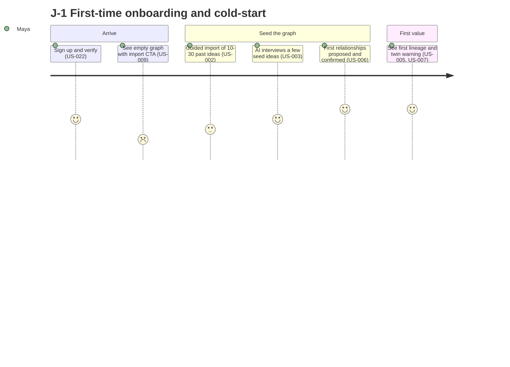
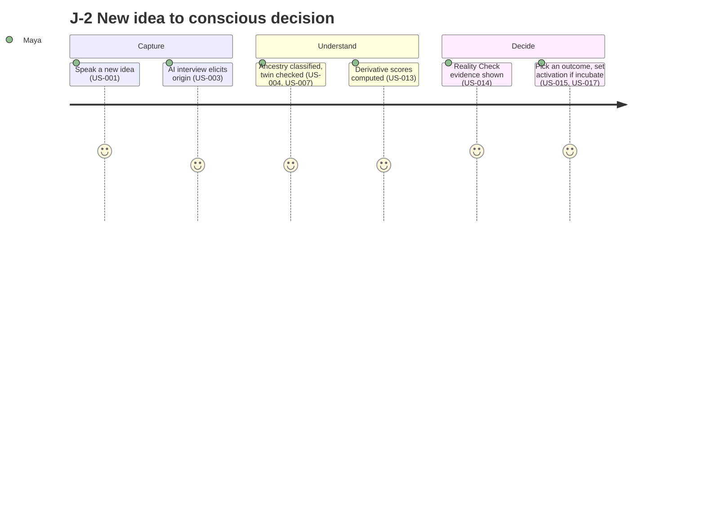

# IdeaOS — Users, Stories & PEAS Specs

> Approval gate: **SK.G2 — Stories + Requirements** (jointly with spec_03_requirements.md).
> Every story has a PEAS spec and Given/When/Then acceptance criteria. 26 stories: 17 Must / 7 Should / 2 Could across 4 personas.

---

## 1. Personas

### P-001 — Maya, the Serial Founder

**Demographics:** 30s, high tech literacy, has started 4 products, shipped 1.
**Context:** Captures ideas at all hours — in the shower, between meetings, mid-build. Switches projects when a new idea feels urgent.
**Goals:**
- Stop abandoning projects when a shinier idea appears
- See the opportunity cost of starting something new *before* committing
**Frustrations:**
- Every idea feels equally important in the moment
- Can't remember why she started half her side projects
**Quote:** "I don't need more ideas. I need to know which one is actually worth my next three months."
**Stories owned:** US-001, US-003, US-008, US-009, US-014, US-015, US-018, US-021, US-022

### P-002 — Dr. Rao, the Independent Researcher

**Demographics:** 40s, very high domain literacy, moderate tooling appetite, PhD + postdoc.
**Context:** Generates research directions constantly; needs to know which are genuinely novel vs rediscoveries of his own past threads.
**Goals:**
- Tell a truly new research direction from a child of an old one
- Preserve every thread so nothing is lost across years
**Frustrations:**
- Rediscovers his own abandoned ideas months later
- No record of *why* a direction was set aside
**Quote:** "Half my 'new' ideas are things I already thought in 2021 and forgot."
**Stories owned:** US-004, US-006, US-011, US-017, US-020, US-023, US-025

### P-003 — Sam, the Indie Engineer

**Demographics:** 20s–30s, expert engineer, builds infrastructure reflexively.
**Context:** Tends to build custom tooling when off-the-shelf would do; ideas spawn sub-ideas that spawn sub-projects.
**Goals:**
- Catch when a "new tool" is really a duplicate of one already built
- Be told when existing software already solves 80%
**Frustrations:**
- Seventh infrastructure project that nobody asked for
- Scope explosion from one small idea
**Quote:** "I built the same caching layer three times in two years."
**Stories owned:** US-002, US-007, US-013, US-016, US-024, US-026

### P-004 — Lena, the Writer / Worldbuilder

**Demographics:** 30s, low–moderate tech literacy, narrative-driven thinker.
**Context:** Builds expansive fictional worlds where characters, systems, and lore descend from each other (the StoryLoom → Character System → Human DNA lineage in the vision).
**Goals:**
- See how a story element evolved from earlier ones
- Replay how a world's ideas grew over time
**Frustrations:**
- Loses the thread of why a character or system exists
- No way to see the lineage of an invented world
**Quote:** "I want to watch my world's ideas grow like a tree."
**Stories owned:** US-005, US-010, US-012, US-019

```yaml
personas:
  - id: P-001
    name: "Maya — Serial Founder"
    demographics: "30s, high tech literacy, 4 products started / 1 shipped"
    context: "Captures ideas constantly; switches projects on impulse"
    goals: ["Stop abandoning projects for shinier ideas", "See opportunity cost before committing"]
    frustrations: ["Every idea feels equally important", "Forgets why projects started"]
    stakeholder_refs: [ST-001, ST-002]
  - id: P-002
    name: "Dr. Rao — Independent Researcher"
    demographics: "40s, very high domain literacy, PhD + postdoc"
    context: "Constant research directions; needs novelty vs rediscovery"
    goals: ["Tell new directions from children of old ones", "Preserve every thread"]
    frustrations: ["Rediscovers own abandoned ideas", "No record of why set aside"]
    stakeholder_refs: [ST-002]
  - id: P-003
    name: "Sam — Indie Engineer"
    demographics: "20s-30s, expert engineer, infra-reflexive"
    context: "Builds custom tooling; ideas spawn sub-projects"
    goals: ["Catch duplicate tools", "Be told when existing software suffices"]
    frustrations: ["Needless infrastructure projects", "Scope explosion"]
    stakeholder_refs: [ST-002]
  - id: P-004
    name: "Lena — Writer / Worldbuilder"
    demographics: "30s, low-moderate tech literacy, narrative thinker"
    context: "Expansive fictional worlds with descended elements"
    goals: ["See lineage of story elements", "Replay world's growth"]
    frustrations: ["Loses thread of why elements exist", "No lineage view"]
    stakeholder_refs: [ST-002]
```

---

## 2. User Stories

> Format per `shared/user-story-format.md`. Every story has a complete PEAS spec. Platform default for all stories unless overridden: `[web-desktop, web-mobile]`, `broadband`, `[en-US]`, regulatory `[GDPR]`.

### US-001 — Capture an idea by voice

**Persona:** P-001 — Maya
**Priority:** Must
**Status:** draft

**As a** serial founder
**I want** to speak an idea aloud and have it captured without any form or template
**so that** I never lose a thought to the friction of writing it down.

```peas
story_id: US-001
performance:
  - metric: voice_capture_to_saved_node
    target: "p95 < 8s from end-of-speech to saved draft idea"
    measurement: rum_telemetry
  - metric: transcription_word_error_rate
    target: "<= 8% WER on clear speech"
    measurement: ai_eval_harness
environment:
  platforms: [web-desktop, web-mobile]
  network: intermittent
  locales: [en-US]
  device_constraints:
    min_screen_width: 360
    browser_support: ["Chrome 110+", "Safari 16+", "Firefox 110+"]
  regulatory: [GDPR]
actuators:
  - action: start_voice_capture
    interface: "VoiceCaptureButton.tsx"
  - action: transcribe_audio
    interface: "POST /api/v1/capture/transcribe"
    side_effects: [call_llm_transcription, write_audit_log]
  - action: create_draft_idea
    interface: "POST /api/v1/ideas"
    side_effects: [write_db, enqueue_interview_job]
sensors:
  - input: audio_stream
    source: microphone_mediastream
    validation: "<= 5 min; mic permission granted"
  - input: transcript_text
    source: transcription_result
    validation: "non-empty after trim"
trace:
  personas: [P-001]
  requirements: [FR-001, FR-002, NFR-001]
  screens: [SCR-002]
```

**Acceptance Criteria:**
- **AC-1:** Given mic permission granted, When Maya taps capture and speaks, Then a transcript appears and a draft idea node is saved within 8s.
- **AC-2:** Given the network drops mid-capture, When speech ends, Then audio is queued locally and the idea is created on reconnect with no loss.
- **AC-3:** Given mic permission denied, When Maya taps capture, Then she is offered text capture (US-002) with a clear explanation.

---

### US-002 — Capture an idea by text

**Persona:** P-003 — Sam
**Priority:** Must
**Status:** draft

**As an** indie engineer
**I want** to type an idea as free text with no required fields
**so that** capture is instant and never blocks on structure.

```peas
story_id: US-002
performance:
  - metric: text_capture_to_saved_node
    target: "p95 < 2s from submit to saved draft idea"
    measurement: rum_telemetry
environment:
  platforms: [web-desktop, web-mobile]
  network: intermittent
  locales: [en-US]
  device_constraints:
    min_screen_width: 360
  regulatory: [GDPR]
actuators:
  - action: render_capture_box
    interface: "CaptureBox.tsx"
  - action: create_draft_idea
    interface: "POST /api/v1/ideas"
    side_effects: [write_db, enqueue_interview_job, enqueue_embedding_job]
sensors:
  - input: idea_text
    source: textarea
    validation: "length 1-5000; trimmed non-empty"
trace:
  personas: [P-003]
  requirements: [FR-002, FR-003]
  screens: [SCR-002]
```

**Acceptance Criteria:**
- **AC-1:** Given an empty capture box, When Sam types text and presses ⌘/Ctrl+Enter, Then a draft idea is saved in < 2s and the box clears.
- **AC-2:** Given text > 5000 chars, When Sam submits, Then he sees an inline limit warning and the idea is not silently truncated.
- **AC-3:** Given offline, When Sam submits, Then the idea is queued and synced on reconnect with a visible pending indicator.

---

### US-003 — AI Socratic interview after capture

**Persona:** P-001 — Maya
**Priority:** Must
**Status:** draft

**As a** serial founder
**I want** the AI to ask me a few targeted questions about a captured idea
**so that** its origin, trigger, purpose, and type are recorded while the context is fresh.

```peas
story_id: US-003
performance:
  - metric: interview_question_relevance
    target: ">= 4.2/5 mean usefulness rating"
    measurement: usability_test
  - metric: first_question_latency
    target: "p95 < 3s after idea created"
    measurement: apm_metric
environment:
  platforms: [web-desktop, web-mobile]
  network: broadband
  locales: [en-US]
  device_constraints:
    min_screen_width: 360
  regulatory: [GDPR]
actuators:
  - action: generate_interview_questions
    interface: "POST /api/v1/ideas/:id/interview"
    side_effects: [call_llm_reasoning, write_db]
  - action: record_interview_answers
    interface: "PATCH /api/v1/ideas/:id/origin"
    side_effects: [write_db, enqueue_ancestry_job]
sensors:
  - input: idea_context
    source: idea_record
    validation: "idea exists and belongs to user"
  - input: user_answers
    source: form_field
    validation: "each answer optional; user may skip"
trace:
  personas: [P-001]
  requirements: [FR-004, FR-005, NFR-010]
  screens: [SCR-003]
```

**Acceptance Criteria:**
- **AC-1:** Given a freshly captured idea, When the interview starts, Then the AI asks at most 5 questions covering origin, trigger, problem solved, idea-type (curiosity/necessity/optimization), and existing-solution sufficiency.
- **AC-2:** Given Maya skips a question, When she continues, Then the field is left null and never invented by the AI.
- **AC-3:** Given Maya answers, When she finishes, Then origin/trigger/purpose/type are saved to the node and ancestry analysis is enqueued.
- **AC-4:** Given any AI question, When rendered, Then it is a question — never a directive ("you should build this").

---

### US-004 — Idea ancestry classification

**Persona:** P-002 — Dr. Rao
**Priority:** Must
**Status:** draft

**As an** independent researcher
**I want** the AI to classify a new idea against my whole graph (new / similar / duplicate / child / sibling / multi-parent)
**so that** I instantly know whether I am genuinely breaking new ground.

```peas
story_id: US-004
performance:
  - metric: ancestry_classification_accuracy
    target: ">= 0.80 macro-F1 on labeled eval set"
    measurement: ai_eval_harness
  - metric: classification_latency
    target: "p95 < 6s for graphs up to 5k nodes"
    measurement: apm_metric
environment:
  platforms: [web-desktop, web-mobile]
  network: broadband
  locales: [en-US]
  device_constraints:
    min_screen_width: 360
  regulatory: [GDPR]
actuators:
  - action: embed_idea
    interface: "POST /api/v1/ideas/:id/embed"
    side_effects: [call_embedding_provider, write_db]
  - action: classify_ancestry
    interface: "POST /api/v1/ideas/:id/ancestry"
    side_effects: [call_llm_reasoning, write_db]
sensors:
  - input: idea_embedding
    source: embedding_provider
    validation: "vector dim matches index"
  - input: candidate_neighbors
    source: pgvector_knn
    validation: "top-k nearest by cosine; k<=25"
trace:
  personas: [P-002]
  requirements: [FR-006, FR-007, NFR-012]
  screens: [SCR-004]
```

**Acceptance Criteria:**
- **AC-1:** Given a new idea and a non-empty graph, When ancestry runs, Then it returns one of {new, similar, duplicate, child, sibling, multi-parent} with a confidence score and the supporting neighbor ideas.
- **AC-2:** Given a duplicate (≥ 0.85 similarity), When classified, Then it is flagged as a twin and the existing idea is shown side-by-side.
- **AC-3:** Given every classification, When surfaced, Then it cites the specific neighbor idea IDs that drove it (provenance) and is never presented as a certainty above its confidence.

---

### US-005 — Reasoning-chain reconstruction ("where did I come from?")

**Persona:** P-004 — Lena
**Priority:** Should
**Status:** draft

**As a** worldbuilder
**I want** to ask any idea "where did you come from?" and see its full lineage explained
**so that** I understand how a story element evolved from earlier ones.

```peas
story_id: US-005
performance:
  - metric: chain_reconstruction_faithfulness
    target: ">= 95% of chain steps cite a real edge (no invented links)"
    measurement: ai_eval_harness
environment:
  platforms: [web-desktop, web-mobile]
  network: broadband
  locales: [en-US]
  device_constraints:
    min_screen_width: 360
  regulatory: [GDPR]
actuators:
  - action: reconstruct_reasoning_chain
    interface: "GET /api/v1/ideas/:id/ancestry-chain"
    side_effects: [call_llm_reasoning]
  - action: render_lineage
    interface: "LineagePanel.tsx"
sensors:
  - input: idea_id
    source: route_param
    validation: "idea exists and belongs to user"
trace:
  personas: [P-004]
  requirements: [FR-008]
  screens: [SCR-005]
```

**Acceptance Criteria:**
- **AC-1:** Given an idea with ancestors, When Lena requests its chain, Then she sees an ordered lineage (root → … → this idea) with a one-line explanation per hop.
- **AC-2:** Given every hop, When displayed, Then it corresponds to a real reasoning edge in the graph; the AI may narrate but may not introduce links that do not exist.
- **AC-3:** Given a root idea with no ancestors, When requested, Then the panel states the idea is a root, not an error.

---

### US-006 — Automatic relationship detection

**Persona:** P-002 — Dr. Rao
**Priority:** Must
**Status:** draft

**As an** independent researcher
**I want** the AI to propose edges (parent, child, dependency, supports, conflicts, duplicates, inspired-by) for a new idea
**so that** my graph stays connected without manual linking.

```peas
story_id: US-006
performance:
  - metric: edge_proposal_precision
    target: ">= 0.75 precision on confirmed edges (labeled eval)"
    measurement: ai_eval_harness
environment:
  platforms: [web-desktop, web-mobile]
  network: broadband
  locales: [en-US]
  device_constraints:
    min_screen_width: 360
  regulatory: [GDPR]
actuators:
  - action: propose_relationships
    interface: "POST /api/v1/ideas/:id/relationships/propose"
    side_effects: [call_llm_reasoning, write_db]
  - action: confirm_relationship
    interface: "POST /api/v1/edges"
    side_effects: [write_db, write_audit_log]
sensors:
  - input: candidate_pairs
    source: pgvector_knn
    validation: "top-k neighbors with similarity >= 0.55"
  - input: user_confirmation
    source: ui_action
    validation: "accept | reject | edit per proposed edge"
trace:
  personas: [P-002]
  requirements: [FR-009, FR-010, NFR-012]
  screens: [SCR-004, SCR-006]
```

**Acceptance Criteria:**
- **AC-1:** Given a new idea, When relationship detection runs, Then proposed edges are shown as *suggestions with a reason and confidence*, never auto-committed.
- **AC-2:** Given a proposed edge, When Dr. Rao accepts/rejects/edits it, Then only confirmed edges persist to the graph and the action is audit-logged.
- **AC-3:** Given each proposed edge, When shown, Then it states its type and an "X because Y" reason referencing both ideas.

---

### US-007 — Duplicate / twin detection

**Persona:** P-003 — Sam
**Priority:** Must
**Status:** draft

**As an** indie engineer
**I want** to be warned when a new idea is substantially the same as one I already have
**so that** I don't rebuild something that already exists.

```peas
story_id: US-007
performance:
  - metric: twin_detection_recall
    target: ">= 0.80 recall of >=0.85-similarity twins (eval set)"
    measurement: ai_eval_harness
  - metric: false_twin_rate
    target: "<= 15% of flagged twins rejected by user"
    measurement: analytics
environment:
  platforms: [web-desktop, web-mobile]
  network: broadband
  locales: [en-US]
  device_constraints:
    min_screen_width: 360
  regulatory: [GDPR]
actuators:
  - action: detect_twins
    interface: "POST /api/v1/ideas/:id/twins"
    side_effects: [call_embedding_provider, write_db]
  - action: render_twin_warning
    interface: "TwinWarning.tsx"
sensors:
  - input: similarity_scores
    source: pgvector_cosine
    validation: "threshold configurable; default 0.85"
trace:
  personas: [P-003]
  requirements: [FR-011, FR-012]
  screens: [SCR-004]
```

**Acceptance Criteria:**
- **AC-1:** Given a new idea with a ≥ 0.85 similarity match, When capture completes, Then Sam sees a twin warning with the existing idea and the similarity percentage.
- **AC-2:** Given a twin warning, When Sam confirms it is a duplicate, Then he can Merge (US-016) directly from the warning.
- **AC-3:** Given Sam marks a flagged twin as "not a duplicate", When he dismisses it, Then the signal is recorded to tune the threshold and the two stay distinct.

---

### US-008 — View an idea node's full detail

**Persona:** P-001 — Maya
**Priority:** Must
**Status:** draft

**As a** serial founder
**I want** to open an idea and see everything recorded about it
**so that** I can understand it at a glance before deciding anything.

```peas
story_id: US-008
performance:
  - metric: node_detail_render
    target: "p95 < 300ms (cached graph)"
    measurement: rum_telemetry
environment:
  platforms: [web-desktop, web-mobile]
  network: broadband
  locales: [en-US]
  device_constraints:
    min_screen_width: 360
  regulatory: [GDPR]
actuators:
  - action: fetch_idea_detail
    interface: "GET /api/v1/ideas/:id"
  - action: render_node_detail
    interface: "NodeDetail.tsx"
sensors:
  - input: idea_id
    source: route_param
    validation: "idea exists and belongs to user"
trace:
  personas: [P-001]
  requirements: [FR-013]
  screens: [SCR-007]
```

**Acceptance Criteria:**
- **AC-1:** Given an idea, When Maya opens it, Then she sees parent, origin, purpose, trigger, dependencies, supported projects, estimated cost, estimated benefit, opportunity cost, build status, and activation condition.
- **AC-2:** Given a field was never captured, When displayed, Then it reads "not recorded" — never a fabricated value.
- **AC-3:** Given the node detail, When shown, Then it links to ancestry (US-005), archaeology (US-020), and the decision step (US-015).

---

### US-009 — Living graph home screen

**Persona:** P-001 — Maya
**Priority:** Must
**Status:** draft

**As a** serial founder
**I want** my home screen to be my living idea graph
**so that** I see the shape of my thinking, not a to-do list.

```peas
story_id: US-009
performance:
  - metric: graph_initial_render
    target: "p95 < 1.5s for graphs up to 2k nodes"
    measurement: rum_telemetry
  - metric: graph_interaction_fps
    target: ">= 45 fps on pan/zoom (mid-range laptop)"
    measurement: rum_telemetry
environment:
  platforms: [web-desktop, web-mobile]
  network: broadband
  locales: [en-US]
  device_constraints:
    min_screen_width: 360
    min_memory_mb: 1024
  regulatory: [GDPR]
actuators:
  - action: fetch_graph
    interface: "GET /api/v1/graph"
  - action: render_graph_canvas
    interface: "GraphCanvas.tsx (WebGL)"
sensors:
  - input: viewport_state
    source: canvas_events
    validation: "pan/zoom bounded to graph extent"
  - input: node_status
    source: idea_records
    validation: "status drives node color"
trace:
  personas: [P-001]
  requirements: [FR-014, FR-015, NFR-001]
  screens: [SCR-001]
```

**Acceptance Criteria:**
- **AC-1:** Given a populated graph, When Maya opens the app, Then the home screen renders the graph with nodes colored by build status (build / incubate / schedule / research / archive / complete).
- **AC-2:** Given a node, When Maya clicks it, Then the node detail (US-008) opens without leaving the graph context.
- **AC-3:** Given an empty graph (new user), When the home loads, Then she sees the onboarding/import call-to-action, not a blank canvas.

---

### US-010 — Navigate the graph (zoom / filter / collapse / expand)

**Persona:** P-004 — Lena
**Priority:** Should
**Status:** draft

**As a** worldbuilder
**I want** to zoom, filter, and collapse/expand branches of my graph
**so that** a large world stays legible.

```peas
story_id: US-010
performance:
  - metric: filter_apply_latency
    target: "p95 < 200ms for client-side filter"
    measurement: rum_telemetry
environment:
  platforms: [web-desktop, web-mobile]
  network: broadband
  locales: [en-US]
  device_constraints:
    min_screen_width: 768
  regulatory: [GDPR]
actuators:
  - action: apply_graph_filter
    interface: "GraphControls.tsx"
  - action: collapse_expand_branch
    interface: "GraphCanvas.tsx"
sensors:
  - input: filter_criteria
    source: control_panel
    validation: "enum status/type/depth; valid ranges"
  - input: branch_toggle
    source: node_action
    validation: "node has children to collapse"
trace:
  personas: [P-004]
  requirements: [FR-016]
  screens: [SCR-001]
```

**Acceptance Criteria:**
- **AC-1:** Given a large graph, When Lena filters by status or type, Then only matching nodes (and their connectors) remain visible in < 200ms.
- **AC-2:** Given a branch, When Lena collapses it, Then descendants hide behind a count badge and expanding restores them.
- **AC-3:** Given a zoom level, When Lena zooms out far, Then labels declutter (level-of-detail) instead of overlapping.

---

### US-011 — Search ideas across the graph

**Persona:** P-002 — Dr. Rao
**Priority:** Should
**Status:** draft

**As an** independent researcher
**I want** to search my ideas semantically and by keyword
**so that** I can find a thread I half-remember.

```peas
story_id: US-011
performance:
  - metric: search_latency
    target: "p95 < 400ms (hybrid keyword + vector)"
    measurement: apm_metric
environment:
  platforms: [web-desktop, web-mobile]
  network: broadband
  locales: [en-US]
  device_constraints:
    min_screen_width: 360
  regulatory: [GDPR]
actuators:
  - action: search_ideas
    interface: "GET /api/v1/search?q="
    side_effects: [call_embedding_provider]
  - action: render_results
    interface: "SearchResults.tsx"
sensors:
  - input: query_text
    source: search_field
    validation: "length 1-200"
trace:
  personas: [P-002]
  requirements: [FR-017]
  screens: [SCR-008]
```

**Acceptance Criteria:**
- **AC-1:** Given a partial-memory query, When Dr. Rao searches, Then results combine keyword and semantic matches ranked by relevance in < 400ms.
- **AC-2:** Given a result, When clicked, Then the graph centers and highlights that node.
- **AC-3:** Given no matches, When searched, Then an empty state suggests capturing the idea as new.

---

### US-012 — Relationship highlighting on selection

**Persona:** P-004 — Lena
**Priority:** Could
**Status:** draft

**As a** worldbuilder
**I want** selecting a node to highlight its relationships
**so that** I can see what an element connects to at a glance.

```peas
story_id: US-012
performance:
  - metric: highlight_response
    target: "p95 < 100ms after selection"
    measurement: rum_telemetry
environment:
  platforms: [web-desktop, web-mobile]
  network: broadband
  locales: [en-US]
  device_constraints:
    min_screen_width: 768
  regulatory: [GDPR]
actuators:
  - action: highlight_relationships
    interface: "GraphCanvas.tsx"
sensors:
  - input: selected_node
    source: canvas_click
    validation: "node exists in current view"
trace:
  personas: [P-004]
  requirements: [FR-018]
  screens: [SCR-001]
```

**Acceptance Criteria:**
- **AC-1:** Given a selected node, When selection occurs, Then its direct edges and neighbors are emphasized and unrelated nodes dim.
- **AC-2:** Given edge types, When highlighted, Then each edge type is visually distinguishable (e.g., color/dash).
- **AC-3:** Given deselection, When Lena clicks empty canvas, Then full-graph styling returns.

---

### US-013 — Derivative analysis scores

**Persona:** P-003 — Sam
**Priority:** Must
**Status:** draft

**As an** indie engineer
**I want** each idea to carry derivative scores (depth, leverage, dependency, cost, opportunity cost, value, risk)
**so that** I can see an idea's strategic shape, not just its description.

```peas
story_id: US-013
performance:
  - metric: derivative_score_explainability
    target: "100% of scores expose the factors that produced them"
    measurement: manual_audit
  - metric: score_compute_latency
    target: "p95 < 5s on idea/graph change"
    measurement: apm_metric
environment:
  platforms: [web-desktop, web-mobile]
  network: broadband
  locales: [en-US]
  device_constraints:
    min_screen_width: 360
  regulatory: [GDPR]
actuators:
  - action: compute_derivative_scores
    interface: "POST /api/v1/ideas/:id/derivative"
    side_effects: [call_llm_reasoning, write_db]
  - action: render_score_panel
    interface: "DerivativePanel.tsx"
sensors:
  - input: graph_neighborhood
    source: graph_query
    validation: "ancestors + descendants resolved"
trace:
  personas: [P-003]
  requirements: [FR-019, FR-020, NFR-012]
  screens: [SCR-007]
```

**Acceptance Criteria:**
- **AC-1:** Given an idea, When scores compute, Then depth, leverage, dependency, cost, opportunity cost, derivative value, and derivative risk are shown.
- **AC-2:** Given any score, When Sam taps it, Then the factors behind it are explained (e.g., leverage = N descendant projects benefiting), with the contributing idea IDs.
- **AC-3:** Given the graph changes (new edge), When relevant, Then affected scores recompute and update the panel.

---

### US-014 — Reality Check evidence panel

**Persona:** P-001 — Maya
**Priority:** Must
**Status:** draft

**As a** serial founder
**I want** an evidence panel before I decide on an idea
**so that** I commit on evidence, not excitement.

```peas
story_id: US-014
performance:
  - metric: reality_check_groundedness
    target: "100% of evidence claims cite a source record"
    measurement: ai_eval_harness
  - metric: reality_check_latency
    target: "p95 < 7s to assemble panel"
    measurement: apm_metric
environment:
  platforms: [web-desktop, web-mobile]
  network: broadband
  locales: [en-US]
  device_constraints:
    min_screen_width: 360
  regulatory: [GDPR]
actuators:
  - action: assemble_reality_check
    interface: "POST /api/v1/ideas/:id/reality-check"
    side_effects: [call_llm_reasoning, write_db]
  - action: render_reality_check
    interface: "RealityCheck.tsx"
sensors:
  - input: idea_and_graph_context
    source: graph_query
    validation: "scores + edges + twins resolved"
trace:
  personas: [P-001]
  requirements: [FR-021, FR-022, NFR-010, NFR-013]
  screens: [SCR-009]
```

**Acceptance Criteria:**
- **AC-1:** Given an idea, When Maya opens Reality Check, Then she sees evidence items such as: expected delay, duplication of another project, existing-solution coverage %, origin/trigger, and how many future products it supports.
- **AC-2:** Given each evidence item, When shown, Then it cites the source (an idea, an edge, a score) and a confidence — and contains no recommendation verb ("should", "must build").
- **AC-3:** Given low confidence in an item, When rendered, Then the uncertainty is shown explicitly rather than asserted as fact.

---

### US-015 — Make a decision (seven outcomes)

**Persona:** P-001 — Maya
**Priority:** Must
**Status:** draft

**As a** serial founder
**I want** to record a decision on an idea with one of seven outcomes
**so that** every idea has a deliberate disposition.

```peas
story_id: US-015
performance:
  - metric: decision_record_latency
    target: "p95 < 1s to persist decision"
    measurement: rum_telemetry
environment:
  platforms: [web-desktop, web-mobile]
  network: broadband
  locales: [en-US]
  device_constraints:
    min_screen_width: 360
  regulatory: [GDPR]
actuators:
  - action: record_decision
    interface: "POST /api/v1/ideas/:id/decision"
    side_effects: [write_db, write_audit_log, update_build_status]
sensors:
  - input: decision_outcome
    source: decision_control
    validation: "enum: [build_now, schedule, incubate, delegate, archive, merge, reject]"
  - input: decision_rationale
    source: textarea
    validation: "optional free text; user-authored"
trace:
  personas: [P-001]
  requirements: [FR-023, FR-024]
  screens: [SCR-009]
```

**Acceptance Criteria:**
- **AC-1:** Given Reality Check is shown, When Maya picks an outcome, Then the idea's build status updates and the decision (with timestamp + optional rationale) is recorded immutably in the audit log.
- **AC-2:** Given the "Incubate" outcome, When chosen, Then Maya is prompted to set an activation condition (US-017).
- **AC-3:** Given the "Merge" outcome, When chosen, Then the merge flow (US-016) opens.
- **AC-4:** Given any outcome, When recorded, Then the idea is never deleted — even Reject/Archive preserve the node (Principle 3: nothing is forgotten).

---

### US-016 — Merge duplicate ideas

**Persona:** P-003 — Sam
**Priority:** Should
**Status:** draft

**As an** indie engineer
**I want** to merge a duplicate idea into its twin
**so that** my graph has one canonical node instead of redundant ones.

```peas
story_id: US-016
performance:
  - metric: merge_integrity
    target: "0 orphaned edges after merge (100% re-parented)"
    measurement: integration_test
environment:
  platforms: [web-desktop]
  network: broadband
  locales: [en-US]
  device_constraints:
    min_screen_width: 768
  regulatory: [GDPR]
actuators:
  - action: merge_ideas
    interface: "POST /api/v1/ideas/:id/merge"
    side_effects: [write_db, write_audit_log, rewrite_edges]
sensors:
  - input: source_and_target
    source: merge_dialog
    validation: "both ideas belong to user; not already merged"
  - input: field_resolution
    source: merge_form
    validation: "user chooses surviving value per conflicting field"
trace:
  personas: [P-003]
  requirements: [FR-025]
  screens: [SCR-010]
```

**Acceptance Criteria:**
- **AC-1:** Given two twins, When Sam merges source into target, Then all edges re-point to the target with no orphans and the merge is audit-logged.
- **AC-2:** Given conflicting fields, When merging, Then Sam chooses the surviving value per field; nothing is silently dropped.
- **AC-3:** Given a merge, When complete, Then the source node is preserved as a tombstone referencing the target (nothing is forgotten), not hard-deleted.

---

### US-017 — Set an activation condition

**Persona:** P-002 — Dr. Rao
**Priority:** Must
**Status:** draft

**As an** independent researcher
**I want** to attach an evidence-based activation condition to an incubated idea
**so that** it becomes reality when the evidence is right, not when I happen to feel excited.

```peas
story_id: US-017
performance:
  - metric: activation_condition_persist
    target: "p95 < 1s to save condition"
    measurement: rum_telemetry
environment:
  platforms: [web-desktop, web-mobile]
  network: broadband
  locales: [en-US]
  device_constraints:
    min_screen_width: 360
  regulatory: [GDPR]
actuators:
  - action: set_activation_condition
    interface: "PUT /api/v1/ideas/:id/activation-condition"
    side_effects: [write_db, register_condition_monitor]
sensors:
  - input: condition_definition
    source: activation_form
    validation: "structured trigger (metric/threshold) or free-text evidence rule; non-empty"
trace:
  personas: [P-002]
  requirements: [FR-026, FR-027]
  screens: [SCR-011]
```

**Acceptance Criteria:**
- **AC-1:** Given an incubated idea, When Dr. Rao defines an activation condition (e.g., "when 3 projects need a shared representation"), Then it is saved and shown on the node.
- **AC-2:** Given a structured condition (countable trigger), When saved, Then it is registered for monitoring (US-018).
- **AC-3:** Given a free-text condition, When saved, Then it is preserved verbatim and surfaced for periodic human review (not auto-evaluated).

---

### US-018 — Activation monitoring & evidence alert

**Persona:** P-001 — Maya
**Priority:** Should
**Status:** draft

**As a** serial founder
**I want** IdeaOS to notice when an incubated idea's activation condition is met
**so that** I'm told an idea is *ready* — with evidence, not a nudge to build it.

```peas
story_id: US-018
performance:
  - metric: activation_detection_freshness
    target: "condition re-evaluated <= 24h after qualifying graph change"
    measurement: integration_test
environment:
  platforms: [web-desktop, web-mobile]
  network: broadband
  locales: [en-US]
  device_constraints:
    min_screen_width: 360
  regulatory: [GDPR]
actuators:
  - action: evaluate_activation_conditions
    interface: "JOB activation-monitor (cron)"
    side_effects: [write_db, enqueue_notification]
  - action: render_activation_alert
    interface: "ActivationAlert.tsx"
sensors:
  - input: graph_change_events
    source: event_stream
    validation: "node/edge/score changes since last run"
trace:
  personas: [P-001]
  requirements: [FR-028, NFR-010]
  screens: [SCR-012]
```

**Acceptance Criteria:**
- **AC-1:** Given an idea whose structured condition becomes satisfied, When the monitor runs, Then Maya gets an alert stating the *evidence* that the condition is met — not an instruction to build.
- **AC-2:** Given an alert, When opened, Then it links to the Reality Check (US-014) and decision step (US-015) so Maya, not the system, decides.
- **AC-3:** Given a condition that stops being satisfied before action, When re-evaluated, Then the alert is withdrawn and the idea returns to incubating.

---

### US-019 — Time Machine (snapshots + playback)

**Persona:** P-004 — Lena
**Priority:** Should
**Status:** draft

**As a** worldbuilder
**I want** to replay how my graph evolved over time
**so that** I can watch my world's ideas grow.

```peas
story_id: US-019
performance:
  - metric: snapshot_job_reliability
    target: ">= 99% of daily snapshots captured"
    measurement: apm_metric
  - metric: playback_frame_load
    target: "p95 < 500ms per timeline step"
    measurement: rum_telemetry
environment:
  platforms: [web-desktop]
  network: broadband
  locales: [en-US]
  device_constraints:
    min_screen_width: 1024
  regulatory: [GDPR]
actuators:
  - action: capture_daily_snapshot
    interface: "JOB snapshot-daily (cron)"
    side_effects: [write_db]
  - action: render_timeline_playback
    interface: "TimeMachine.tsx"
sensors:
  - input: timeline_position
    source: scrubber
    validation: "within available snapshot range"
trace:
  personas: [P-004]
  requirements: [FR-029, FR-030]
  screens: [SCR-013]
```

**Acceptance Criteria:**
- **AC-1:** Given daily snapshots exist, When Lena opens Time Machine, Then she can scrub a timeline and watch nodes/edges appear over the period.
- **AC-2:** Given a timeline position, When selected, Then the graph reflects exactly the state at that date (read-only).
- **AC-3:** Given a new user with < 2 snapshots, When opening Time Machine, Then an explanatory empty state is shown, not a broken player.

---

### US-020 — Idea Archaeology view

**Persona:** P-002 — Dr. Rao
**Priority:** Should
**Status:** draft

**As an** independent researcher
**I want** a single view of an idea's complete history
**so that** I can see all of its ancestors, descendants, siblings, twins, influences, and conflicts at once.

```peas
story_id: US-020
performance:
  - metric: archaeology_completeness
    target: "100% of stored relations represented (no silent omission)"
    measurement: integration_test
environment:
  platforms: [web-desktop]
  network: broadband
  locales: [en-US]
  device_constraints:
    min_screen_width: 1024
  regulatory: [GDPR]
actuators:
  - action: fetch_idea_archaeology
    interface: "GET /api/v1/ideas/:id/archaeology"
  - action: render_archaeology
    interface: "Archaeology.tsx"
sensors:
  - input: idea_id
    source: route_param
    validation: "idea exists and belongs to user"
trace:
  personas: [P-002]
  requirements: [FR-031]
  screens: [SCR-014]
```

**Acceptance Criteria:**
- **AC-1:** Given an idea, When Dr. Rao opens Archaeology, Then ancestors, descendants, siblings, twins, influences, conflicts, and the reason-for-creation are each listed.
- **AC-2:** Given each entry, When shown, Then it links to that idea and the edge that connects them.
- **AC-3:** Given an idea with no relations, When opened, Then each empty category is labeled (e.g., "no conflicts recorded"), not hidden.

---

### US-021 — Decision Dashboard

**Persona:** P-001 — Maya
**Priority:** Must
**Status:** draft

**As a** serial founder
**I want** a dashboard that continuously answers what I'm building and what's waiting
**so that** I always know my current commitments and what could activate next.

```peas
story_id: US-021
performance:
  - metric: dashboard_load
    target: "p95 < 1s"
    measurement: rum_telemetry
environment:
  platforms: [web-desktop, web-mobile]
  network: broadband
  locales: [en-US]
  device_constraints:
    min_screen_width: 360
  regulatory: [GDPR]
actuators:
  - action: fetch_decision_dashboard
    interface: "GET /api/v1/dashboard"
  - action: render_dashboard
    interface: "DecisionDashboard.tsx"
sensors:
  - input: user_id
    source: session
    validation: authenticated_user_required
trace:
  personas: [P-001]
  requirements: [FR-032, FR-033]
  screens: [SCR-015]
```

**Acceptance Criteria:**
- **AC-1:** Given a populated graph, When Maya opens the dashboard, Then it answers: what am I building now, why, what is waiting (incubating), what should activate next, and what is costing the most attention.
- **AC-2:** Given each answer, When shown, Then it links to the underlying ideas and is derived from real graph state (no hand-wavy summaries).
- **AC-3:** Given "what new idea is actually an old idea", When computed, Then recently captured ideas with high-similarity twins are surfaced.

---

### US-022 — Account signup & secure authentication

**Persona:** P-001 — Maya
**Priority:** Must
**Status:** draft

**As a** new user
**I want** to create a secure private account
**so that** my idea graph — my whole mind — is protected.

```peas
story_id: US-022
performance:
  - metric: signup_completion_time
    target: "p95 < 30s end-to-end"
    measurement: rum_telemetry
environment:
  platforms: [web-desktop, web-mobile]
  network: broadband
  locales: [en-US]
  device_constraints:
    min_screen_width: 360
    browser_support: ["Chrome 110+", "Safari 16+", "Firefox 110+"]
  regulatory: [GDPR]
actuators:
  - action: create_account
    interface: "POST /api/v1/auth/signup"
    side_effects: [write_db, send_verification_email]
  - action: authenticate
    interface: "POST /api/v1/auth/login"
    side_effects: [issue_tokens, write_audit_log]
sensors:
  - input: email
    source: form_field
    validation: "RFC-5322 email format"
  - input: password
    source: form_field
    validation: "length 12-128; checked against breach list"
trace:
  personas: [P-001]
  requirements: [FR-034, FR-035, NFR-002, NFR-014]
  screens: [SCR-016, SCR-017]
```

**Acceptance Criteria:**
- **AC-1:** Given valid email + strong password, When Maya signs up, Then an account is created, a verification email is sent, and she is guided into onboarding.
- **AC-2:** Given a breached/weak password, When submitted, Then signup is blocked with a clear inline reason.
- **AC-3:** Given 5 failed logins, When the 6th is attempted, Then the account is temporarily rate-limited and the event is audit-logged.

---

### US-023 — Export the full idea graph

**Persona:** P-002 — Dr. Rao
**Priority:** Must
**Status:** draft

**As an** independent researcher
**I want** to export my entire graph in an open format
**so that** my thinking is portable and never held hostage.

```peas
story_id: US-023
performance:
  - metric: export_completion
    target: "p95 < 30s for graphs up to 10k nodes"
    measurement: server_metric
  - metric: export_completeness
    target: "100% of nodes+edges+decisions present (manifest-reconciled)"
    measurement: integration_test
environment:
  platforms: [web-desktop, api]
  network: broadband
  locales: [en-US]
  device_constraints:
    min_screen_width: 768
  regulatory: [GDPR]
actuators:
  - action: generate_graph_export
    interface: "POST /api/v1/export"
    side_effects: [enqueue_export_job, write_audit_log, send_email_when_ready]
sensors:
  - input: export_format
    source: dropdown
    validation: "enum: [json, graphml]"
trace:
  personas: [P-002]
  requirements: [FR-036, NFR-015]
  screens: [SCR-018]
```

**Acceptance Criteria:**
- **AC-1:** Given a graph, When Dr. Rao exports as JSON or GraphML, Then he receives a complete, re-importable file with all nodes, edges, decisions, and scores, plus a manifest with reconciled counts.
- **AC-2:** Given the export job, When complete, Then he is notified and the request is audit-logged.
- **AC-3:** Given a large export, When generating, Then progress is shown and the export does not block the app.

---

### US-024 — Delete account & purge data

**Persona:** P-003 — Sam
**Priority:** Must
**Status:** draft

**As a** user
**I want** to delete my account and have my idea data purged
**so that** I retain control over the most private data I own.

```peas
story_id: US-024
performance:
  - metric: deletion_sla
    target: "soft-delete immediate; hard-purge <= 30 days"
    measurement: audit_log
environment:
  platforms: [web-desktop]
  network: broadband
  locales: [en-US]
  device_constraints:
    min_screen_width: 768
  regulatory: [GDPR]
actuators:
  - action: request_account_deletion
    interface: "DELETE /api/v1/account"
    side_effects: [soft_delete_db, schedule_hard_purge, write_audit_log]
sensors:
  - input: confirmation_phrase
    source: text_input
    validation: "must equal 'DELETE MY IDEAS' exactly"
trace:
  personas: [P-003]
  requirements: [FR-037, NFR-015]
  screens: [SCR-019]
```

**Acceptance Criteria:**
- **AC-1:** Given Sam confirms with the exact phrase, When he requests deletion, Then his data is soft-deleted immediately and scheduled for hard purge within 30 days.
- **AC-2:** Given the grace period, When Sam logs back in before purge, Then he can cancel deletion and recover his graph.
- **AC-3:** Given hard purge runs, When complete, Then all idea content + embeddings are irreversibly removed; only minimal audit metadata (no idea content) is retained per policy.

---

### US-025 — AI evidence carries provenance and is never directive

**Persona:** P-002 — Dr. Rao
**Priority:** Must
**Status:** draft

**As a** thoughtful user
**I want** every AI-surfaced claim to show its source and confidence and never tell me what to do
**so that** I stay the decision-maker and can trust what I see.

```peas
story_id: US-025
performance:
  - metric: non_directive_compliance
    target: "0 directive outputs in 200-sample adversarial+prod audit"
    measurement: ai_eval_harness
  - metric: provenance_coverage
    target: "100% of fact-bearing claims cite a source record"
    measurement: ai_eval_harness
environment:
  platforms: [web-desktop, web-mobile, api]
  network: broadband
  locales: [en-US]
  device_constraints:
    min_screen_width: 360
  regulatory: [GDPR]
actuators:
  - action: enforce_evidence_contract
    interface: "lib/ai/evidence-contract.ts"
    side_effects: [block_directive_output, attach_provenance]
  - action: render_provenance
    interface: "ProvenanceBadge.tsx"
sensors:
  - input: llm_output
    source: model_response
    validation: "passes non-directive + groundedness post-filter"
trace:
  personas: [P-002]
  requirements: [FR-038, NFR-010, NFR-013]
  screens: [SCR-009]
```

**Acceptance Criteria:**
- **AC-1:** Given any AI output that states a fact, When rendered, Then it shows a provenance badge linking to the source idea/edge/score.
- **AC-2:** Given a model response containing a directive ("you should build X"), When post-filtered, Then it is blocked/rewritten to evidence form before it reaches the user, and the event is logged.
- **AC-3:** Given a claim the model cannot ground, When detected, Then it is flagged as "unverified" rather than presented as fact.

---

### US-026 — Capture works offline / degraded network

**Persona:** P-003 — Sam
**Priority:** Could
**Status:** draft

**As an** indie engineer
**I want** capture to work when I'm offline
**so that** a thought on a plane or a tunnel isn't lost.

```peas
story_id: US-026
performance:
  - metric: offline_capture_sync_success
    target: ">= 99% of queued captures sync on reconnect"
    measurement: integration_test
environment:
  platforms: [web-desktop, web-mobile]
  network: offline-capable
  locales: [en-US]
  device_constraints:
    min_screen_width: 360
  regulatory: [GDPR]
actuators:
  - action: queue_offline_capture
    interface: "lib/offline/captureQueue.ts (IndexedDB)"
    side_effects: [write_local_store]
  - action: sync_on_reconnect
    interface: "lib/offline/sync.ts"
    side_effects: [write_db, enqueue_interview_job]
sensors:
  - input: connectivity_state
    source: navigator_online
    validation: "online/offline transitions observed"
trace:
  personas: [P-003]
  requirements: [FR-039]
  screens: [SCR-002]
```

**Acceptance Criteria:**
- **AC-1:** Given offline, When Sam captures an idea, Then it is stored locally with a pending indicator and no error.
- **AC-2:** Given reconnection, When detected, Then queued captures sync in order and downstream jobs (interview, embedding) enqueue.
- **AC-3:** Given a sync conflict (same idea edited elsewhere), When syncing, Then the user is prompted rather than silently overwritten.

---

## 3. User Journeys

> Tier 3 requires ≥ 2. Authored as `mermaid` `journey` diagrams (scores are 1–5 satisfaction; commas, not semicolons).

### Journey: J-1 — First-time onboarding & cold-start (P-001 Maya)



**Drop-off risks:**
- Empty-graph moment (step 2): highest churn risk (R-003) — the import CTA must be the hero, not a blank canvas.
- Guided import friction: too many forced fields would re-introduce the friction IdeaOS exists to remove.

**Optimizations to test (in §8 usability test):**
- Bulk paste + auto-split into idea nodes vs one-at-a-time entry.
- Showing the first relationship/twin as soon as ≥ 2 ideas exist (value before density).

### Journey: J-2 — New idea to conscious decision (the core loop) (P-001 Maya)



**Drop-off risks:**
- Reality Check latency (step "evidence shown"): if assembling the panel is slow (> 7s), momentum is lost.
- Decision paralysis: too many evidence items without hierarchy can recreate the analysis-paralysis the product fights.

**Optimizations to test:**
- Progressive disclosure of evidence (top 3 items first, expand for more).
- One-tap "Incubate with condition" as the safe default outcome.

---

## 4. Story Index

| ID | Title | Persona | Priority | Status | Sprint (from spec_06) |
|----|-------|---------|---------|--------|----------------------|
| US-001 | Capture idea by voice | P-001 | Must | draft | capture.S1 |
| US-002 | Capture idea by text | P-003 | Must | draft | capture.S1 |
| US-003 | AI Socratic interview | P-001 | Must | draft | reasoning.S1 |
| US-004 | Idea ancestry classification | P-002 | Must | draft | reasoning.S2 |
| US-005 | Reasoning-chain reconstruction | P-004 | Should | draft | reasoning.S3 |
| US-006 | Automatic relationship detection | P-002 | Must | draft | reasoning.S2 |
| US-007 | Duplicate / twin detection | P-003 | Must | draft | reasoning.S2 |
| US-008 | View idea node detail | P-001 | Must | draft | graph.S1 |
| US-009 | Living graph home screen | P-001 | Must | draft | graph.S2 |
| US-010 | Navigate graph (zoom/filter/collapse) | P-004 | Should | draft | graph.S3 |
| US-011 | Search ideas | P-002 | Should | draft | graph.S3 |
| US-012 | Relationship highlighting | P-004 | Could | draft | graph.S3 |
| US-013 | Derivative analysis scores | P-003 | Must | draft | reasoning.S3 |
| US-014 | Reality Check evidence panel | P-001 | Must | draft | decision.S1 |
| US-015 | Make a decision (7 outcomes) | P-001 | Must | draft | decision.S1 |
| US-016 | Merge duplicate ideas | P-003 | Should | draft | decision.S2 |
| US-017 | Set activation condition | P-002 | Must | draft | decision.S2 |
| US-018 | Activation monitoring & alert | P-001 | Should | draft | decision.S3 |
| US-019 | Time Machine (snapshots + playback) | P-004 | Should | draft | graph.S4 |
| US-020 | Idea Archaeology view | P-002 | Should | draft | graph.S4 |
| US-021 | Decision Dashboard | P-001 | Must | draft | decision.S3 |
| US-022 | Account signup & auth | P-001 | Must | draft | foundation.S1 |
| US-023 | Export full idea graph | P-002 | Must | draft | foundation.S2 |
| US-024 | Delete account & purge data | P-003 | Must | draft | foundation.S2 |
| US-025 | AI evidence provenance / non-directive | P-002 | Must | draft | reasoning.S1 |
| US-026 | Offline capture | P-003 | Could | draft | capture.S2 |

```yaml
story_index:
  - { id: US-001, title: "Capture idea by voice", persona: P-001, priority: must, status: draft, sprint: "capture.S1" }
  - { id: US-002, title: "Capture idea by text", persona: P-003, priority: must, status: draft, sprint: "capture.S1" }
  - { id: US-003, title: "AI Socratic interview", persona: P-001, priority: must, status: draft, sprint: "reasoning.S1" }
  - { id: US-004, title: "Idea ancestry classification", persona: P-002, priority: must, status: draft, sprint: "reasoning.S2" }
  - { id: US-005, title: "Reasoning-chain reconstruction", persona: P-004, priority: should, status: draft, sprint: "reasoning.S3" }
  - { id: US-006, title: "Automatic relationship detection", persona: P-002, priority: must, status: draft, sprint: "reasoning.S2" }
  - { id: US-007, title: "Duplicate / twin detection", persona: P-003, priority: must, status: draft, sprint: "reasoning.S2" }
  - { id: US-008, title: "View idea node detail", persona: P-001, priority: must, status: draft, sprint: "graph.S1" }
  - { id: US-009, title: "Living graph home screen", persona: P-001, priority: must, status: draft, sprint: "graph.S2" }
  - { id: US-010, title: "Navigate graph", persona: P-004, priority: should, status: draft, sprint: "graph.S3" }
  - { id: US-011, title: "Search ideas", persona: P-002, priority: should, status: draft, sprint: "graph.S3" }
  - { id: US-012, title: "Relationship highlighting", persona: P-004, priority: could, status: draft, sprint: "graph.S3" }
  - { id: US-013, title: "Derivative analysis scores", persona: P-003, priority: must, status: draft, sprint: "reasoning.S3" }
  - { id: US-014, title: "Reality Check evidence panel", persona: P-001, priority: must, status: draft, sprint: "decision.S1" }
  - { id: US-015, title: "Make a decision", persona: P-001, priority: must, status: draft, sprint: "decision.S1" }
  - { id: US-016, title: "Merge duplicate ideas", persona: P-003, priority: should, status: draft, sprint: "decision.S2" }
  - { id: US-017, title: "Set activation condition", persona: P-002, priority: must, status: draft, sprint: "decision.S2" }
  - { id: US-018, title: "Activation monitoring & alert", persona: P-001, priority: should, status: draft, sprint: "decision.S3" }
  - { id: US-019, title: "Time Machine", persona: P-004, priority: should, status: draft, sprint: "graph.S4" }
  - { id: US-020, title: "Idea Archaeology view", persona: P-002, priority: should, status: draft, sprint: "graph.S4" }
  - { id: US-021, title: "Decision Dashboard", persona: P-001, priority: must, status: draft, sprint: "decision.S3" }
  - { id: US-022, title: "Account signup & auth", persona: P-001, priority: must, status: draft, sprint: "foundation.S1" }
  - { id: US-023, title: "Export full idea graph", persona: P-002, priority: must, status: draft, sprint: "foundation.S2" }
  - { id: US-024, title: "Delete account & purge data", persona: P-003, priority: must, status: draft, sprint: "foundation.S2" }
  - { id: US-025, title: "AI evidence provenance / non-directive", persona: P-002, priority: must, status: draft, sprint: "reasoning.S1" }
  - { id: US-026, title: "Offline capture", persona: P-003, priority: could, status: draft, sprint: "capture.S2" }
```

---

## 5. Approval

```yaml
approval:
  facilitator: "Muquaddar"
  reviewers:
    - name: "Muquaddar"
      role: product
      decision: approved
      comments: "Solo self-approval. DEFERRED (tracked, not blocking): ST-002 design-partner recruitment (3-5 partners) couldn't happen pre-code — re-validate personas/JTBD against real partners post-alpha (~graph.S2 milestone, project.yaml open_items)."
    - name: "Muquaddar"
      role: ux
      decision: approved
      comments: ""
  approver: "Muquaddar"
  approved_at: "2026-06-29"
  git_tag: null
  forge_submission_id: null
```

---

## Tier Variations

- **Tier 3 (this project)**: 3–8 personas (4 declared), 20–50 stories (26 declared). Journeys section mandatory (J-1, J-2 present). Solo build → reviewers collapse to the founder across roles.

---

## Quality Bar (SK.G2 — Stories side)

- [x] 26 stories: **17 Must / 7 Should / 2 Could** (counts must match §4 and spec_03 §1)
- [x] Every story has a complete PEAS spec (no empty arrays, no placeholders)
- [x] Every PEAS Performance target is numeric
- [x] PEAS Environment.network and .platforms explicit on every story
- [x] PEAS Actuators ≥ 1; Sensors ≥ 1 on every story
- [x] Acceptance criteria ≥ 3 per story, measurable
- [x] Each story traces to a persona and ≥ 1 requirement (FR/NFR)
- [x] ≥ 2 user journeys mapping to stories (J-1, J-2)
