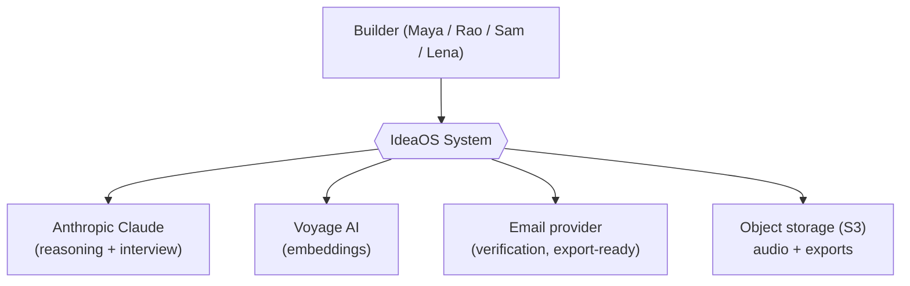
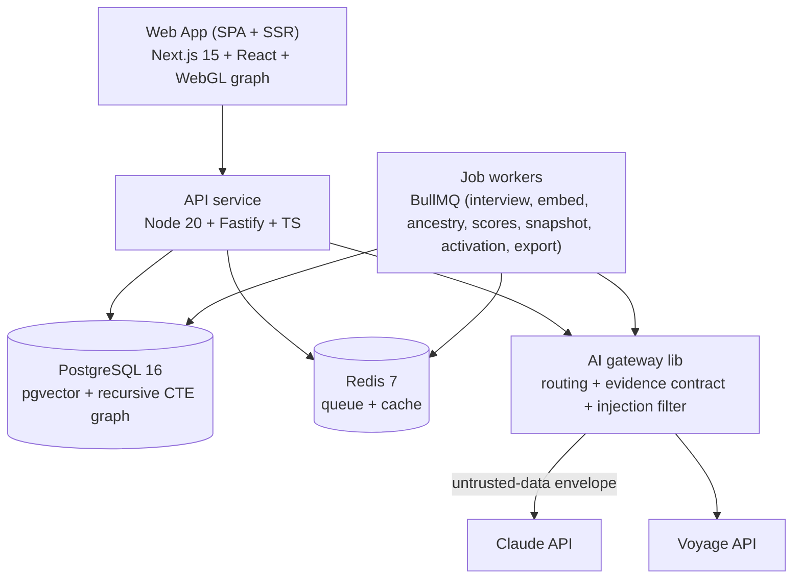
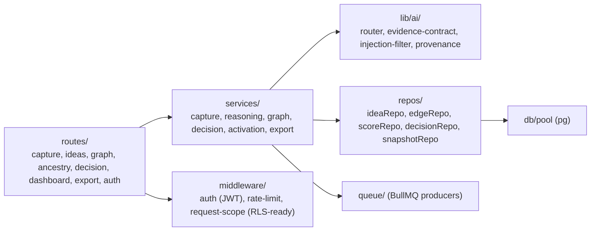
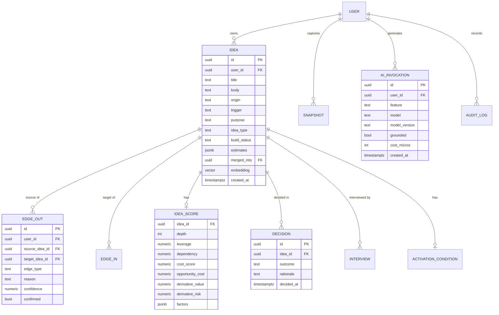
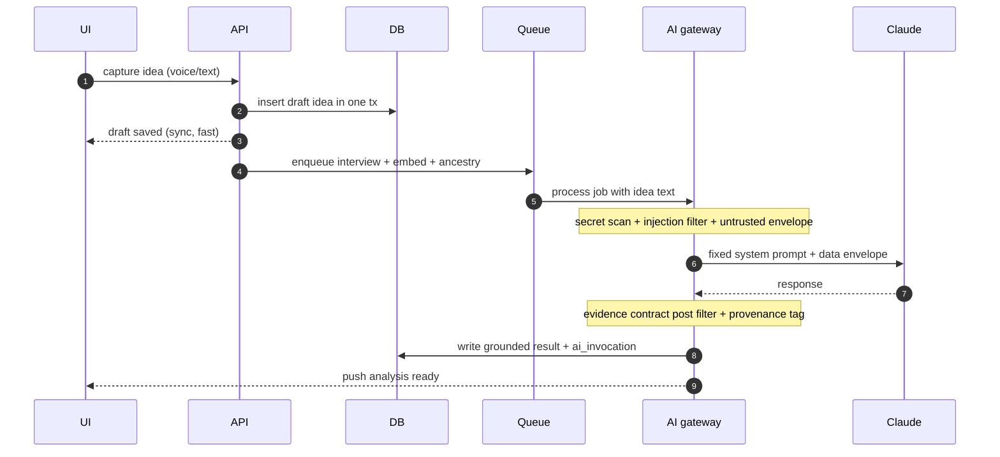
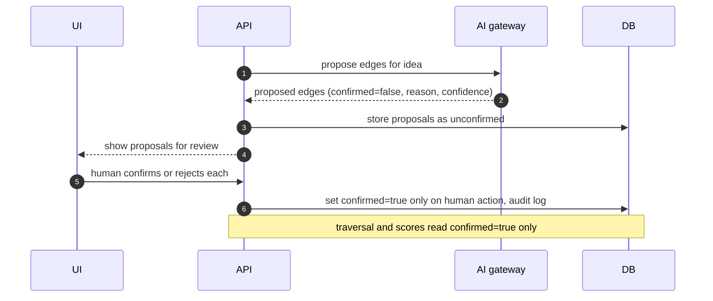
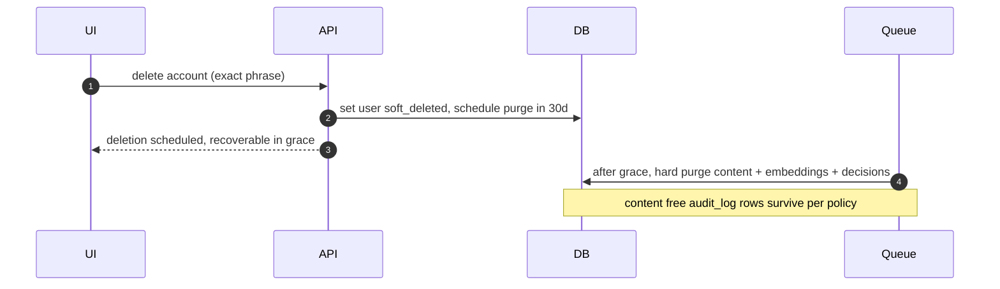
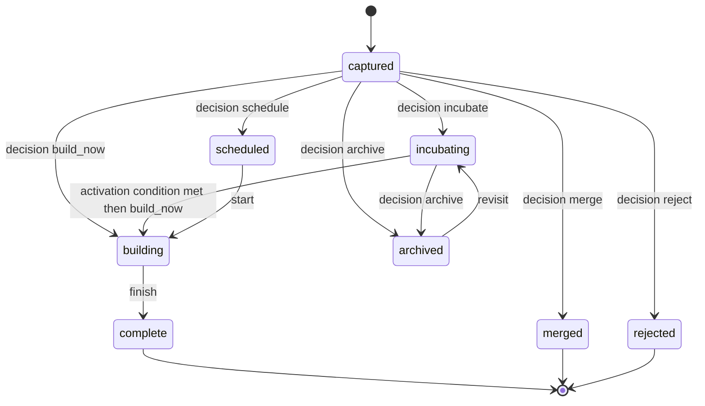
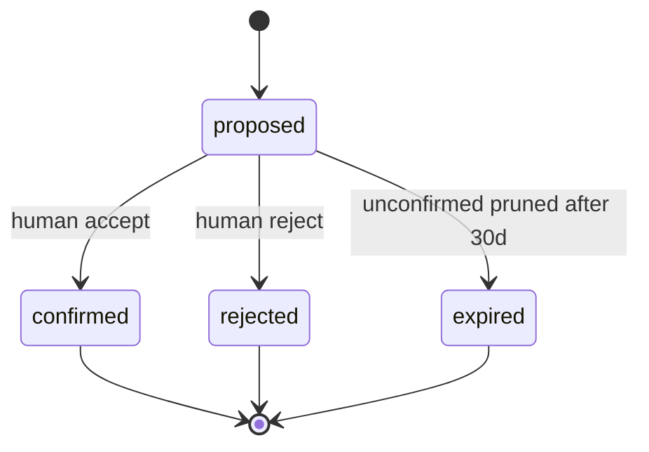

# IdeaOS — Architecture

> Approval gate: **SK.G3 — Design** (jointly with spec_05_design.md).
> Every requirement in spec_03 traces to an architectural element here. IdeaOS is **LLM-backed**, so §11 (AI trust boundary) is mandatory and §9/§11 carry the CRITICAL NFRs (NFR-008/010/011).

---

> **Diagram convention [MP-20].** C4 (§1–3), the ER data model (§4), and critical sequences (§12) are inline `mermaid`; the source in this spec is canonical. Rendered PNG/SVG may accompany under `docs/diagrams/` but is generated from these blocks, never hand-authored.

## 1. System Context Diagram (C4 Level 1)



External systems: an LLM provider (reasoning, interview, reality-check synthesis), an embedding provider (similarity / ancestry candidates), transactional email, and S3-compatible object storage. All idea content sent to the LLM/embedding providers crosses a **trust boundary** governed by §11.

---

## 2. Container Diagram (C4 Level 2)



```yaml
containers:
  - id: web-app
    type: ssr-spa
    tech: "Next.js 15, React 18, TypeScript, Cosmograph/Sigma.js (WebGL), graphology"
    deploy_target: "Render / Fly.io (managed)"
  - id: api-service
    type: service
    tech: "Node 20, Fastify, TypeScript, Zod"
    deploy_target: "Render / Fly.io"
  - id: job-workers
    type: service
    tech: "Node 20, BullMQ"
    deploy_target: "Render / Fly.io (worker process)"
  - id: ai-gateway
    type: library
    tech: "TS module: model routing, evidence-contract post-filter, injection filter, provenance tagging"
    deploy_target: "in-process (api + workers)"
  - id: postgres
    type: datastore
    tech: "PostgreSQL 16 + pgvector"
    deploy_target: "Managed Postgres (Render/Neon/Fly)"
  - id: redis
    type: datastore
    tech: "Redis 7"
    deploy_target: "Managed Redis"
```

---

## 3. Component Diagram (C4 Level 3 — api-service)



The **`lib/ai/` boundary is the single chokepoint** through which all model traffic flows: model routing (Opus vs Haiku), the injection filter on ingested idea text, the non-directive evidence-contract post-filter, and provenance tagging. No service calls a model provider directly (ADR-003, ADR-004).

---

## 4. Data Model



### Entities

| Entity | Description | Key Fields |
|--------|------------|------------|
| users | Account owner | id, email, password_hash, status, created_at |
| ideas | The idea node (graph vertex) | id, user_id, title, body, origin, trigger, purpose, idea_type, build_status, estimates(jsonb), activation/merged refs, embedding(vector) |
| edges | Reasoning edge (graph edge) | id, user_id, source_idea_id, target_idea_id, edge_type, reason, confidence, confirmed |
| idea_scores | Derivative analysis per idea | idea_id, depth, leverage, dependency, cost_score, opportunity_cost, derivative_value, derivative_risk, factors(jsonb) |
| interviews | AI interview Q&A for an idea | id, idea_id, questions(jsonb), answers(jsonb) |
| decisions | Append-only decision record | id, idea_id, outcome, rationale, decided_at |
| activation_conditions | Activation rule per idea | id, idea_id, kind, definition(jsonb), status |
| snapshots | Daily graph snapshot | id, user_id, snapshot_date, graph(jsonb/delta) |
| ai_invocations | Provenance/cost log of every model call | id, user_id, idea_id, feature, model, model_version, grounded, cost_micros, created_at |
| audit_log | Immutable security/decision audit | id, user_id, action, entity, ip, created_at |
| export_jobs / account_deletions | Async export + deletion lifecycle | id, user_id, status, scheduled_purge_at |

### Schemas (machine layer)

```yaml
entities:
  - name: users
    description: "Account owners"
    columns:
      - { name: id, type: uuid, primary_key: true, default: "gen_random_uuid()" }
      - { name: email, type: citext, unique: true, not_null: true }
      - { name: password_hash, type: text, not_null: true }     # Argon2id (NFR-014)
      - { name: status, type: text, default: "'active'", check: "status IN ('active','soft_deleted')" }
      - { name: created_at, type: timestamptz, default: "now()" }
    indexes: [{ columns: [email], unique: true }]
    traces: { requirements: [FR-034, FR-035, NFR-014] }
  - name: ideas
    description: "Idea nodes"
    columns:
      - { name: id, type: uuid, primary_key: true, default: "gen_random_uuid()" }
      - { name: user_id, type: uuid, references: "users(id)", on_delete: cascade, not_null: true }
      - { name: title, type: text }
      - { name: body, type: text, not_null: true }
      - { name: origin, type: text }
      - { name: trigger, type: text }
      - { name: purpose, type: text }
      - { name: idea_type, type: text, check: "idea_type IN ('curiosity','necessity','optimization') OR idea_type IS NULL" }
      - { name: build_status, type: text, default: "'captured'", check: "build_status IN ('captured','incubating','scheduled','building','complete','archived','rejected','merged')" }
      - { name: estimates, type: jsonb, default: "'{}'" }   # cost/benefit/opportunity_cost
      - { name: activation_condition_id, type: uuid, references: "activation_conditions(id)", not_null: false }
      - { name: merged_into, type: uuid, references: "ideas(id)", not_null: false }   # tombstone (FR-025)
      - { name: embedding, type: "vector(1024)", not_null: false }   # voyage-3 dim
      - { name: created_at, type: timestamptz, default: "now()" }
    indexes:
      - { columns: [user_id, build_status] }
      - { type: "hnsw", columns: [embedding], opclass: "vector_cosine_ops" }
    traces: { requirements: [FR-002, FR-005, FR-006, FR-013, FR-024] }
  - name: edges
    description: "Reasoning edges (human-confirmed)"
    columns:
      - { name: id, type: uuid, primary_key: true, default: "gen_random_uuid()" }
      - { name: user_id, type: uuid, references: "users(id)", on_delete: cascade, not_null: true }
      - { name: source_idea_id, type: uuid, references: "ideas(id)", on_delete: cascade, not_null: true }
      - { name: target_idea_id, type: uuid, references: "ideas(id)", on_delete: cascade, not_null: true }
      - { name: edge_type, type: text, check: "edge_type IN ('created_because','depends_on','improves','blocks','inspired_by','duplicates','supports','parent_of')" }
      - { name: reason, type: text }
      - { name: confidence, type: numeric }
      - { name: confirmed, type: boolean, default: "false" }   # only confirmed edges are 'real' (FR-010)
      - { name: created_at, type: timestamptz, default: "now()" }
    indexes:
      - { columns: [user_id, source_idea_id] }
      - { columns: [user_id, target_idea_id] }
    traces: { requirements: [FR-009, FR-010] }
  - name: decisions
    description: "Append-only decision audit"
    columns:
      - { name: id, type: uuid, primary_key: true, default: "gen_random_uuid()" }
      - { name: idea_id, type: uuid, references: "ideas(id)", not_null: true }
      - { name: outcome, type: text, check: "outcome IN ('build_now','schedule','incubate','delegate','archive','merge','reject')" }
      - { name: rationale, type: text }
      - { name: decided_at, type: timestamptz, default: "now()" }
    indexes: [{ columns: [idea_id, decided_at] }]
    traces: { requirements: [FR-023, FR-024] }
  - name: ai_invocations
    description: "Provenance + cost ledger for every model call"
    columns:
      - { name: id, type: uuid, primary_key: true, default: "gen_random_uuid()" }
      - { name: user_id, type: uuid, references: "users(id)", not_null: true }
      - { name: idea_id, type: uuid, references: "ideas(id)", not_null: false }
      - { name: feature, type: text }
      - { name: model, type: text }
      - { name: model_version, type: text }   # NFR-013: provenance carries model_version
      - { name: grounded, type: boolean }
      - { name: cost_micros, type: bigint }    # NFR-017 per-user budget
      - { name: created_at, type: timestamptz, default: "now()" }
    indexes: [{ columns: [user_id, created_at] }]
    traces: { requirements: [FR-038, NFR-012, NFR-013, NFR-017] }
```

> Graph traversal (ancestry chain, archaeology, depth) uses **recursive CTEs over `edges WHERE confirmed = true`**; nearest-neighbor candidate generation uses the **HNSW pgvector index** on `ideas.embedding` (ADR-001).

---

## 5. Technology Stack

| Layer | Choice | Rationale | Alternatives Considered |
|-------|--------|-----------|------------------------|
| Frontend | Next.js 15 + React 18 + TS | SSR for first paint; mature ecosystem; single solo-friendly codebase | Remix, SvelteKit |
| Graph rendering | Cosmograph/Sigma.js (WebGL) + graphology | GPU-accelerated for 10k-node interactivity (NFR-006) | D3-SVG (too slow at scale), Cytoscape |
| Backend | Node 20 + Fastify + TS | One language across web/api/workers (solo leverage); fast; Zod validation | Go, Python/FastAPI |
| Jobs | BullMQ on Redis | Reliable async for interview/embed/ancestry/snapshot/export | Temporal (heavier), cron-only |
| Database | PostgreSQL 16 + pgvector | Relational graph via recursive CTE + vector search in ONE store → minimal ops for solo (ADR-001) | Neo4j + separate vector DB |
| Cache/queue | Redis 7 | Queue + cache + rate-limit store | Memcached + SQS |
| LLM | Anthropic Claude (Opus 4.8 reasoning / Haiku 4.5 classification) | Strong reasoning for ancestry/reality-check; cheap model for classification controls cost (NFR-017) | GPT, Gemini |
| Embeddings | Voyage AI (voyage-3, 1024-dim) | High-quality text embeddings; Anthropic-recommended pairing | OpenAI embeddings, local model |
| Auth | Own email+password (Argon2id) + JWT | Full control for a privacy-first product; OIDC optional later | Auth0/Clerk (3rd-party holds identity) |
| Hosting | Render / Fly.io (managed Postgres+Redis) | No k8s ops burden for a solo founder (ADR-005) | k8s, bare VPS |

```yaml
stack:
  frontend: { framework: "Next.js 15", language: TypeScript, graph: "Cosmograph/Sigma.js + graphology", rationale: "SSR + WebGL scale" }
  backend: { framework: "Fastify", runtime: "Node 20", language: TypeScript, rationale: "one language across tiers; solo leverage" }
  jobs: { engine: "BullMQ", rationale: "reliable async AI pipeline" }
  database: { engine: "PostgreSQL 16 + pgvector", rationale: "graph (recursive CTE) + vectors in one store" }
  cache: { engine: "Redis 7", rationale: "queue + cache + rate-limit" }
  ai:
    reasoning_model: "claude-opus-4-8"
    cheap_model: "claude-haiku-4-5"
    embeddings: "voyage-3 (1024-dim)"
    rationale: "strong reasoning where it matters; cheap classification for cost control"
  auth: { method: "email+password (Argon2id) + JWT", provider: self, rationale: "privacy-first; full control" }
  hosting: { platform: "Render / Fly.io", rationale: "no k8s ops for solo founder" }
```

---

## 6. Integrations

### Integration: Anthropic Claude (INT-001)
- **Purpose:** interview question generation, ancestry/relationship reasoning, derivative reasoning, reality-check synthesis.
- **Protocol:** REST (Anthropic Messages API) via SDK. **Auth:** API key (KMS-stored).
- **Data exchanged:** idea text + graph-neighbor context, assembled as an **untrusted-data envelope** (§11.1).
- **SLA / failure mode:** degrade_gracefully — on outage, capture + graph viewing keep working; AI features queue and retry; UI shows "analysis pending".

### Integration: Voyage AI (INT-002)
- **Purpose:** text embeddings for similarity/ancestry/twin detection. **Protocol:** REST. **Auth:** API key.
- **Failure mode:** degrade_gracefully — embeddings queue; keyword search remains; twin detection deferred.

### Integration: Email + Object storage (INT-003, INT-004)
- Email: verification, export-ready, deletion confirmations. S3: voice audio (short-lived) + export artifacts.

```yaml
integrations:
  - { id: INT-001, name: "Anthropic Claude", purpose: "reasoning + interview", protocol: rest, auth: api_key, data_exchanged: "idea text + neighbor context (untrusted envelope)", sla: "provider best-effort", failure_mode: degrade_gracefully, traces: { requirements: [FR-004, FR-007, FR-009, FR-019, FR-021, FR-038] } }
  - { id: INT-002, name: "Voyage AI", purpose: "embeddings", protocol: rest, auth: api_key, data_exchanged: "idea text", sla: "provider best-effort", failure_mode: degrade_gracefully, traces: { requirements: [FR-006, FR-011, FR-017] } }
  - { id: INT-003, name: "Email provider", purpose: "transactional email", protocol: rest, auth: api_key, data_exchanged: "address + template vars (no idea content)", sla: "99.9%", failure_mode: degrade_gracefully, traces: { requirements: [FR-034, FR-036, FR-037] } }
  - { id: INT-004, name: "Object storage (S3)", purpose: "audio + exports", protocol: sdk, auth: iam, data_exchanged: "audio blobs, export files", sla: "99.9%", failure_mode: fail_closed, traces: { requirements: [FR-001, FR-036] } }
```

---

## 7. ADRs

### ADR-001 — Postgres + pgvector for graph & similarity (not a dedicated graph DB)
**Status:** accepted · **Date:** 2026-06-29
**Context:** IdeaOS needs graph traversal (ancestry, archaeology, depth) AND vector similarity (ancestry/twins). Options: Neo4j + a vector DB (2 stores), or Postgres with recursive CTEs + pgvector (1 store).
**Decision:** One PostgreSQL 16 instance with `pgvector` (HNSW) and recursive CTE traversal over a `confirmed` edge table.
**Consequences:**
- **Positive:** single store to operate/back up/secure (solo ops); transactional consistency between nodes, edges, and embeddings; one DR story.
- **Negative:** very deep/wide traversals are less optimized than a native graph engine; recall tuning of HNSW needed.
- **Mitigation:** graphs are per-user and bounded (10k nodes target); cache hot subgraphs in Redis; revisit a graph engine only if traversal latency (NFR-006) regresses.

### ADR-002 — Two-model LLM routing (Opus reasoning / Haiku classification) + Voyage embeddings
**Status:** accepted · **Date:** 2026-06-29
**Context:** Deep reasoning (reality check, ancestry synthesis) needs a strong model; high-volume classification (interview-question gen, edge typing) does not, and cost must stay within NFR-017.
**Decision:** Route reasoning to `claude-opus-4-8`, classification/cheap paths to `claude-haiku-4-5`; embeddings via `voyage-3`. Model + model_version logged to `ai_invocations`.
**Consequences:** Positive: cost control + quality where it matters. Negative: two prompt families to maintain; model-version drift. Mitigation: re-eval pipeline on model change (NFR-013).

### ADR-003 — Non-directive evidence contract as an architectural layer
**Status:** accepted · **Date:** 2026-06-29
**Context:** The product's core promise is "the AI never decides" (NFR-010, CRITICAL). A prompt instruction alone is insufficient.
**Decision:** All model output passes through `lib/ai/evidence-contract` which (a) constrains prompts to evidence-only, (b) post-filters output to block/rewrite directive language, and (c) attaches provenance. No service may bypass it.
**Consequences:** Positive: a single enforceable chokepoint with an adversarial test suite. Negative: post-filter adds latency + a maintenance surface. Mitigation: filter runs in-stream; covered by the blocking eval suite (NFR-010/013).

### ADR-004 — Human-in-the-loop edge confirmation (no auto-committed relationships)
**Status:** accepted · **Date:** 2026-06-29
**Context:** Injected/ambiguous idea text could cause the AI to assert false relationships; auto-committing them would corrupt the graph and be a confused-deputy vector (NFR-011).
**Decision:** AI only *proposes* edges (`confirmed=false`); traversal/scores consider only `confirmed=true` edges; persistence of a confirmed edge requires an explicit human action.
**Consequences:** Positive: the model can change what is *said*, never what the graph *commits*; injection cannot silently alter structure. Negative: more user taps during onboarding. Mitigation: batch-confirm UI; high-confidence pre-selection (still user-approved).

### ADR-005 — Managed PaaS (Render/Fly.io), not Kubernetes
**Status:** accepted · **Date:** 2026-06-29
**Context:** Solo founder, ≤ 30 hrs/week; ops time is the scarcest resource.
**Decision:** Deploy web/api/worker as managed services with managed Postgres + Redis; no self-managed k8s.
**Consequences:** Positive: minimal ops; built-in TLS, backups, rolling deploys. Negative: less control; some vendor lock-in. Mitigation: 12-factor app + containerized → portable if needed.

### ADR-006 — WebGL graph rendering for scale
**Status:** accepted · **Date:** 2026-06-29
**Context:** The home screen IS the graph and must stay interactive at thousands of nodes (NFR-006).
**Decision:** GPU/WebGL renderer (Cosmograph/Sigma.js) with graphology as the client model; level-of-detail labeling.
**Consequences:** Positive: 10k-node interactivity. Negative: WebGL edge cases on low-end devices. Mitigation: SVG fallback for tiny graphs; min-memory env constraint declared (US-009/US-019).

```yaml
adrs:
  - { id: ADR-001, title: "Postgres+pgvector for graph & similarity", status: accepted, date: "2026-06-29", superseded_by: null, summary: "One store: recursive-CTE graph + HNSW vectors" }
  - { id: ADR-002, title: "Two-model LLM routing + Voyage embeddings", status: accepted, date: "2026-06-29", superseded_by: null, summary: "Opus reasoning / Haiku classification; voyage-3" }
  - { id: ADR-003, title: "Non-directive evidence contract layer", status: accepted, date: "2026-06-29", superseded_by: null, summary: "Single enforced chokepoint for all model output" }
  - { id: ADR-004, title: "Human-in-the-loop edge confirmation", status: accepted, date: "2026-06-29", superseded_by: null, summary: "AI proposes; only confirmed edges are real" }
  - { id: ADR-005, title: "Managed PaaS over k8s", status: accepted, date: "2026-06-29", superseded_by: null, summary: "Minimal solo ops" }
  - { id: ADR-006, title: "WebGL graph rendering", status: accepted, date: "2026-06-29", superseded_by: null, summary: "GPU rendering for 10k-node scale" }
```

---

## 8. Non-Functional Architecture Concerns

| NFR | How Architecture Addresses It |
|-----|-------------------------------|
| NFR-001 (latency) | Capture writes a draft synchronously; all AI work is async (BullMQ); hot subgraph cached in Redis; HNSW index for fast KNN |
| NFR-002 (auth rate-limit) | Fastify rate-limiter (Redis-backed) on auth routes; lockout counter |
| NFR-003 (uptime) | Managed multi-instance api + worker; health checks; graceful AI degradation keeps core usable during provider outages |
| NFR-006 (scale) | WebGL rendering (ADR-006); per-user bounded graphs; CTE + HNSW |
| NFR-008 (encryption, CRITICAL) | TLS 1.3 in transit; AES-256 at rest (managed-DB + S3 SSE); keys in KMS; see §9 |
| NFR-010 (non-directive, CRITICAL) | Evidence-contract layer (ADR-003) — §11.1 |
| NFR-011 (injection, CRITICAL) | Untrusted-data envelope + injection filter + human-confirmed edges (ADR-004) — §11.1–11.2 |
| NFR-012 (grounding) | Provenance tagging in `lib/ai`; `ai_invocations.grounded`; ungrounded flagged |
| NFR-013 (eval) | Golden eval sets + CI regression-eval; `model_version` in provenance |
| NFR-016 (DR) | §10.4 RTO/RPO; PITR backups; restore drills |

---

## 9. Security Architecture

- **AuthN:** email + password (Argon2id, breach-list checked); JWT access (15 min) + refresh (7 days, rotating, httpOnly+SameSite cookie). OIDC is a later option.
- **AuthZ:** every row is user-scoped; all queries filter by `user_id` from the verified token; request-scope middleware is **RLS-ready** so row-level security can be switched on without app changes. The user's token scope is the ceiling of any AI-driven action (confused-deputy guard, §11.1).
- **Transport:** TLS 1.3 everywhere; HSTS.
- **At rest (NFR-008, CRITICAL):** AES-256 managed-DB + S3 SSE; idea content and embeddings encrypted; KMS-managed keys; voice audio is short-TTL and deleted after transcription.
- **Secrets:** provider API keys + DB creds in the platform secret manager / KMS; never in the repo.
- **Input validation:** Zod schemas on every endpoint; captured idea text is validated for size but treated as **untrusted content** downstream (§11).
- **Audit log:** auth events, decisions, edge confirmations, exports, deletions — immutable, no idea *content* stored in audit rows.

---

## 10. Database Management, Data Lifecycle & Disaster Recovery

### 10.1 Migration management
- Tool: node-pg-migrate (or Drizzle migrations). **Expand → migrate → contract**; no destructive change in the same deploy as the code needing it.
- Online index builds (`CREATE INDEX CONCURRENTLY`), including HNSW rebuilds.
- Every migration ships a tested `down`; CI runs forward + rollback on an ephemeral seeded DB.

### 10.2 Data lifecycle (unbounded-growth tables)

| Data class | Growth | Strategy | Retained or transient? |
|---|---|---|---|
| ai_invocations | monotonic | monthly RANGE partition; aggregate to per-user/day cost rollups > 90d; drop raw > 13mo | cost-retained (rollups) |
| audit_log | monotonic | monthly RANGE partition; cold archive > 13mo | regulated-retained |
| snapshots | daily/user | store deltas not full graphs; weekly→monthly compaction > 90d | retained (compacted) |
| decisions | append-only | keep (small; core history — Principle 3) | retained |
| edges (proposed, unconfirmed) | churn | prune `confirmed=false` proposals > 30d | transient |

### 10.3 Consolidated data retention & deletion policy (MP-18 / NFR-015)

```yaml
data_retention_policy:
  - { data_class: "idea content (ideas, body, origin)", retention: "life of account", on_account_delete: "purged after grace" }
  - { data_class: "embeddings", retention: "life of account", on_account_delete: "purged after grace" }
  - { data_class: "decisions", retention: "life of account", on_account_delete: "purged after grace" }
  - { data_class: "snapshots", retention: "compacted, life of account", on_account_delete: "purged after grace" }
  - { data_class: "ai_invocations (raw)", retention: "13 months", on_account_delete: "purged after grace" }
  - { data_class: "audit_log (no idea content)", retention: "13 months then archive", on_account_delete: "retained (security/legal); contains no idea content" }
  - { data_class: "voice audio", retention: "until transcription + 24h", on_account_delete: "already deleted" }
  account_deletion_workflow:
    grace_period_days: 30          # soft-delete window; user can cancel (US-024 AC-2)
    after_grace: "hard-purge idea content + embeddings + decisions + snapshots; audit_log (content-free) survives"
    legal_hold: "suspends purge for held scope only"
```

### 10.4 Disaster-recovery targets (MP-17 / NFR-016)

```yaml
disaster_recovery:
  failure_classes:
    - { class: "bad-deploy/rollback", rto: "<=30m", rpo: "<=5m", mechanism: "previous image redeploy; managed PITR" }
    - { class: "db-corruption/accidental-delete", rto: "<=2h", rpo: "<=5m", mechanism: "managed Postgres PITR (continuous WAL)" }
    - { class: "zonal", rto: "<=2h", rpo: "<=15m", mechanism: "managed HA / multi-AZ where offered", status: "real" }
    - { class: "regional", rto: "<=12h", rpo: "<=24h", mechanism: "nightly cross-region backup restore", status: "accepted-residual-risk-owned-by-ST-001 (solo, single-region v1.0)" }
  backup_retention_days: 35
  restore_test_frequency: "quarterly"   # drill verifies RTO/RPO + export-completeness
```

### 10.5 Immutability ↔ erasure ↔ retention reconciliation (MP-10)
The `decisions` and `audit_log` tables are append-only (Principle 3: nothing is forgotten). On erasure, idea-content-bearing rows (`decisions.rationale` is user content) are purged; the `audit_log` retains only **content-free** action metadata (action, entity-id, timestamp, ip), so the security trail survives without retaining the user's idea content. This is the explicit resolution.

### 10.6 Connection pooling & maintenance
- pgBouncer (transaction pooling); request-scoped session vars via `SET LOCAL` (so RLS, when enabled, never bleeds across pooled connections).
- autovacuum tuned for high-churn `edges`/`ai_invocations`; scheduled HNSW rebuild + a recall regression guard.

### 10.7 Seeding & fixtures
- Reference data: edge-type taxonomy, idea-type enum, default similarity thresholds.
- Deterministic committed fixtures: the **ancestry/twin golden eval sets** and the **adversarial injection + non-directive corpora** (reproducible, not generated at test time — they back NFR-010/011/013).

---

## 11. AI / LLM Trust Boundary, Evaluation & Cost  *(MANDATORY — IdeaOS is LLM-backed)*

### 11.1 Trust boundary & non-directive + injection defense (CRITICAL: NFR-010, NFR-011)
- **All captured idea text is UNTRUSTED DATA.** It is assembled into a delimited data envelope; the system prompt is fixed, isolated, and instructs the model to treat envelope content as data, never instructions.
- **Injection filter** scans ingested idea text before any model call; suspicious instruction-like payloads are quarantined and flagged.
- **Confused-deputy guard:** an AI-driven action's authority is the *user token's* scope, enforced at the authz layer. Injected text can change what the model *says*, never what the graph *commits* — and **edges only persist on explicit human confirmation** (ADR-004). No AI output can satisfy a human-only gate (decisions, edge confirmation, deletion).
- **Non-directive evidence contract:** every model response passes the `evidence-contract` post-filter; directive language ("you should build X", "the best choice is…") is blocked/rewritten into evidence form, and the event is logged. Adversarial suites for both injection and directiveness are **blocking in CI** (NFR-010/011, NFR-013).

### 11.2 Ingested-secret detection & redaction
- Idea text can contain secrets (a user pastes a config/idea with a key). Secret-scan ingested content **before** embedding or any LLM call; redact detected secrets (never embed/transmit/store), and notify the user.

### 11.3 Output grounding / provenance (NFR-012)
- Every fact-bearing AI claim (ancestry classification, twin %, derivative factor, reality-check item) must cite the source record(s) — idea IDs, edge IDs, score factors. Un-citable assertions are flagged "unverified", not rendered as fact. `ai_invocations.grounded` records the outcome.

### 11.4 Evaluation harness (NFR-013)
- **Golden eval sets:** ancestry classification (macro-F1 ≥ 0.80), twin detection (recall ≥ 0.80 @0.85), reasoning-chain faithfulness (≥ 95% real-edge), non-directive (0 directives / 200), provenance coverage (100%).
- A **CI regression-eval job gates merges**; a **re-evaluation pipeline runs on model-version change**; `model_version` is recorded in provenance.

### 11.5 LLM cost model & unit economics (NFR-017)
```yaml
llm_cost_model:
  metered_paths: ["interview (Haiku)", "ancestry+relationships (Haiku→Opus escalate)", "derivative reasoning (Opus)", "reality check (Opus)", "embeddings (voyage-3)"]
  per_tenant_budget: "monthly per-user AI budget; on overrun, escalate-to-Opus disabled + non-critical jobs queued (never silent overspend)"
  cost_driver: "capture frequency x reasoning depth; Opus calls dominate — minimized via Haiku-first routing + caching of stable analyses"
  margin_link: "feeds spec_07 §10 Business Model & Unit Economics"
```

---

## 12. Critical Runtime Sequences (MP-12)

### Seq 1 — Capture to analysis pipeline (trust boundary crossing)


### Seq 2 — Relationship proposal with human confirmation (confused-deputy guard)


### Seq 3 — Account deletion (soft-delete to hard-purge)


### State lifecycle — idea build_status


> Note: `merged`, `rejected`, `archived`, and `complete` never delete the node (Principle 3); `merged` keeps a tombstone (`merged_into`).

### State lifecycle — proposed edge


---

## 13. Approval

```yaml
approval:
  facilitator: "Muquaddar"
  reviewers:
    - { name: "Muquaddar", role: tech, decision: approved }
    - { name: "Muquaddar", role: architect, decision: approved }
    - { name: "Muquaddar", role: security, decision: approved, comments: "DEFERRED (tracked, not blocking): NFR-017 AI cost-budget assumptions (Anthropic + Voyage account-level pricing) confirmed against §11 trust-boundary design at infra.S1/T-504, before the budget-alarm objective ships." }
  approver: "Muquaddar"
  approved_at: "2026-06-29"
  git_tag: null
  forge_submission_id: null
```

---

## Tier Variations

- **Tier 3 (this project)**: Full C4 Levels 1–3; founder reviews as security lead; AI-safety architecture (§11) reviewed because the system is LLM-backed.

---

## Quality Bar (SK.G3 — Architecture side)

- [x] C4 Level 1 + 2 (+ 3) present
- [x] Every entity traces to ≥ 1 functional requirement
- [x] Every tech stack choice has rationale
- [x] All ADRs have Consequences (positive + negative + mitigation)
- [x] Every NFR has an architectural response (§8)
- [x] Security architecture covers AuthN, AuthZ, transport, secrets, input validation (§9)
- [x] DB management & lifecycle (§10): migrations, unbounded-table strategy, retention/deletion, DR (RTO/RPO per failure class), immutability↔erasure reconciliation
- [x] AI/LLM trust boundary (§11): injection defense, ingested-secret redaction, grounding, eval harness, cost model
- [x] Critical runtime sequences (§12) for the most security/correctness-critical flows + state lifecycles
- [x] Diagrams inline `mermaid` (C4, ER, sequences) — source-in-spec canonical
