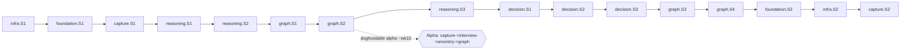

# IdeaOS — Build Plan

> Approval gate: **SK.G4 — Build Plan** (jointly with spec_07_launch.md).
> Forge v2's `parse-spec-build.js` parses §3. **Every Must FR (23) maps to ≥ 1 objective** and the **CRITICAL NFRs (NFR-008/010/011)** have blocking suites (§7). Built **solo, serial** — see the capacity profile (§6).

---

## 1. Build Tracks

> Tracks are **concurrent-ownership units, not concurrent execution** (solo build — MP-06). They are sequenced serially; the critical path is the serial sum of sprints (§4).

| Track ID | Title | Owner | Depends on | Description |
|---------|-------|-------|-----------|-------------|
| infra | Infrastructure, CI & eval harness | founder | — | CI/CD, sk-lint gate, the AI eval/safety suites, observability, DR |
| foundation | Accounts, security & data rights | founder | infra | Auth, encryption, export, erasure |
| capture | Idea capture | founder | foundation | Voice/text/offline capture |
| reasoning | AI reasoning core | founder | capture, infra | Evidence contract, interview, ancestry, relationships, twins, derivative |
| graph | Graph & visualization | founder | reasoning | Node detail, WebGL home, navigate, search, time machine, archaeology |
| decision | Decision & activation | founder | reasoning, graph | Reality Check, decision, merge, activation, dashboard |

```yaml
tracks_summary:
  - { id: infra, title: "Infrastructure, CI & eval harness", owner: "Muquaddar", depends_on: [] }
  - { id: foundation, title: "Accounts, security & data rights", owner: "Muquaddar", depends_on: [infra] }
  - { id: capture, title: "Idea capture", owner: "Muquaddar", depends_on: [foundation] }
  - { id: reasoning, title: "AI reasoning core", owner: "Muquaddar", depends_on: [capture, infra] }
  - { id: graph, title: "Graph & visualization", owner: "Muquaddar", depends_on: [reasoning] }
  - { id: decision, title: "Decision & activation", owner: "Muquaddar", depends_on: [reasoning, graph] }
```

---

## 2. Sprint Cadence

| Parameter | Value |
|-----------|-------|
| Sprint length | 2 weeks |
| Execution | serial-solo (one sprint at a time) |
| Weekly focus cap | ≤ 30 focused hours (SC-006 sustainability) |
| Sprint review | end of each sprint — dogfood the build on IdeaOS's own backlog |
| Sprint retro | self-retro + issue log into the SRIJAN issues tracker |

---

## 3. Sprint Plan — Machine Layer (Forge parses this)

```yaml
sprint_plan:
  cadence_weeks: 2
  start_date: "2026-07-06"
  execution: serial-solo
  tracks:
    - id: infra
      sprints:
        - id: S1
          title: "CI/CD, sk-lint gate, eval & safety suites, observability"
          duration_weeks: 2
          objectives:
            - { id: T-501, criterion: "GitHub Actions runs lint + test + sk-lint (exit 0) on every PR; red blocks merge", verifiable_by: ci_artifact, requirement_refs: [], story_refs: [] }
            - { id: T-502, criterion: "Merge to main deploys to staging + runs smoke tests", verifiable_by: deploy_log, requirement_refs: [NFR-003], story_refs: [] }
            - { id: T-503, criterion: "CI blocks merge on the three AI safety suites: adversarial prompt-injection, non-directive output, evidence groundedness", verifiable_by: ci_artifact, requirement_refs: [NFR-010, NFR-011, NFR-013], story_refs: [US-025] }
            - { id: T-504, criterion: "OpenTelemetry traces emitted; per-user AI cost metered to ai_invocations; budget alarm fires over ceiling", verifiable_by: integration_test, requirement_refs: [NFR-017], story_refs: [] }
          gate_check: EK.G2.infra-S1
        - id: S2
          title: "Resilience & disaster recovery"
          duration_weeks: 2
          objectives:
            - { id: T-505, criterion: "PITR backups enabled; quarterly restore drill verifies RTO/RPO + export completeness", verifiable_by: deploy_log, requirement_refs: [NFR-016], story_refs: [] }
            - { id: T-506, criterion: "Every migration runs forward + rollback on an ephemeral seeded DB in CI", verifiable_by: ci_artifact, requirement_refs: [NFR-016], story_refs: [] }
            - { id: T-507, criterion: "Rollback procedure executed on staging; log linked in spec_07 §4", verifiable_by: deploy_log, requirement_refs: [NFR-003], story_refs: [] }
          gate_check: EK.G2.infra-S2

    - id: foundation
      sprints:
        - id: S1
          title: "Accounts & auth security"
          duration_weeks: 2
          objectives:
            - { id: T-001, criterion: "POST /api/v1/auth/signup creates account + sends verification email; breach-checked Argon2id password", verifiable_by: integration_test, requirement_refs: [FR-034, NFR-014], story_refs: [US-022] }
            - { id: T-002, criterion: "POST /api/v1/auth/login issues access(15m)+refresh(7d rotating httpOnly) tokens; auth events audit-logged", verifiable_by: integration_test, requirement_refs: [FR-035, NFR-014], story_refs: [US-022] }
            - { id: T-003, criterion: "Auth rate-limited <=10 req/min/IP; account locks after 5 failed logins", verifiable_by: integration_test, requirement_refs: [NFR-002], story_refs: [US-022] }
            - { id: T-004, criterion: "Idea content + embeddings encrypted at rest (AES-256/KMS); TLS 1.3 enforced end to end", verifiable_by: integration_test, requirement_refs: [NFR-008], story_refs: [] }
          gate_check: EK.G2.foundation-S1
        - id: S2
          title: "Data rights: export & erasure"
          duration_weeks: 2
          objectives:
            - { id: T-005, criterion: "POST /api/v1/export produces JSON/GraphML with a reconciled completeness manifest (100% nodes+edges+decisions)", verifiable_by: integration_test, requirement_refs: [FR-036, NFR-015], story_refs: [US-023] }
            - { id: T-006, criterion: "DELETE /api/v1/account soft-deletes immediately, recoverable within 30d grace", verifiable_by: integration_test, requirement_refs: [FR-037, NFR-015], story_refs: [US-024] }
            - { id: T-007, criterion: "Hard-purge job after grace removes idea content + embeddings; content-free audit rows survive", verifiable_by: integration_test, requirement_refs: [FR-037, NFR-016], story_refs: [US-024] }
          gate_check: EK.G2.foundation-S2

    - id: capture
      sprints:
        - id: S1
          title: "Capture core (voice + text)"
          duration_weeks: 2
          objectives:
            - { id: T-101, criterion: "Voice capture records, transcribes, and saves a draft idea within p95 8s on supported browsers", verifiable_by: e2e_test, requirement_refs: [FR-001, NFR-005], story_refs: [US-001] }
            - { id: T-102, criterion: "Text capture saves a draft idea with zero required fields in p95 < 2s", verifiable_by: e2e_test, requirement_refs: [FR-002], story_refs: [US-002] }
            - { id: T-103, criterion: "Capture box validates 1-5000 chars and warns without truncating", verifiable_by: e2e_test, requirement_refs: [FR-003], story_refs: [US-002] }
            - { id: T-104, criterion: "Creating an idea enqueues interview + embedding jobs", verifiable_by: integration_test, requirement_refs: [FR-002], story_refs: [US-001, US-002] }
          gate_check: EK.G2.capture-S1
        - id: S2
          title: "Offline capture & sync"
          duration_weeks: 2
          objectives:
            - { id: T-105, criterion: "Offline capture stores the idea in IndexedDB with a visible pending indicator", verifiable_by: e2e_test, requirement_refs: [FR-039], story_refs: [US-026] }
            - { id: T-106, criterion: "On reconnect, queued captures sync in order and enqueue downstream jobs; conflicts prompt the user", verifiable_by: integration_test, requirement_refs: [FR-039], story_refs: [US-026] }
            - { id: T-107, criterion: "Voice capture during a network drop queues audio and creates the idea on reconnect with no loss", verifiable_by: e2e_test, requirement_refs: [FR-001], story_refs: [US-001] }
          gate_check: EK.G2.capture-S2

    - id: reasoning
      sprints:
        - id: S1
          title: "AI gateway, evidence contract & injection defense (CRITICAL guardrails)"
          duration_weeks: 2
          objectives:
            - { id: T-201, criterion: "AI gateway routes reasoning->Opus / classification->Haiku and logs each call to ai_invocations with model_version", verifiable_by: integration_test, requirement_refs: [NFR-013], story_refs: [] }
            - { id: T-202, criterion: "Interview generates <=5 Socratic questions and records answers to origin/trigger/purpose/type; skipped fields stay null", verifiable_by: integration_test, requirement_refs: [FR-004, FR-005], story_refs: [US-003] }
            - { id: T-203, criterion: "Evidence contract blocks or rewrites directive output and attaches provenance before display (0 directives on the 200-sample audit)", verifiable_by: integration_test, requirement_refs: [FR-038, NFR-010, NFR-012], story_refs: [US-025] }
            - { id: T-204, criterion: "Ingested idea text is wrapped as untrusted data, injection-filtered, and secret-redacted before any model call; adversarial suite passes", verifiable_by: integration_test, requirement_refs: [NFR-011], story_refs: [] }
          gate_check: EK.G2.reasoning-S1
        - id: S2
          title: "Ancestry, relationships & twins"
          duration_weeks: 2
          objectives:
            - { id: T-205, criterion: "Idea is embedded and ancestry-classified (new/similar/duplicate/child/sibling/multi-parent) with confidence + supporting neighbor IDs", verifiable_by: integration_test, requirement_refs: [FR-006, FR-007, NFR-012], story_refs: [US-004] }
            - { id: T-206, criterion: "Typed edges are proposed with reason+confidence; only human-confirmed edges persist; confirmations are audit-logged", verifiable_by: integration_test, requirement_refs: [FR-009, FR-010], story_refs: [US-006] }
            - { id: T-207, criterion: "Twin detection flags >=0.85-similarity matches with a warning; not-duplicate feedback is recorded to tune the threshold", verifiable_by: integration_test, requirement_refs: [FR-011, FR-012], story_refs: [US-007] }
            - { id: T-208, criterion: "Ancestry (F1>=0.80) and twin (recall>=0.80) golden eval sets run as a CI regression-eval gating merges", verifiable_by: ci_artifact, requirement_refs: [NFR-013], story_refs: [US-004, US-007] }
          gate_check: EK.G2.reasoning-S2
        - id: S3
          title: "Derivative analysis & lineage"
          duration_weeks: 2
          objectives:
            - { id: T-209, criterion: "Derivative scores computed per idea: depth, leverage, dependency, cost, opportunity cost, derivative value, derivative risk", verifiable_by: integration_test, requirement_refs: [FR-019], story_refs: [US-013] }
            - { id: T-210, criterion: "Each derivative score exposes its contributing factors + idea IDs", verifiable_by: integration_test, requirement_refs: [FR-020], story_refs: [US-013] }
            - { id: T-211, criterion: "Reasoning-chain reconstruction returns an ordered lineage citing only real edges (>=95% faithfulness); root case handled", verifiable_by: integration_test, requirement_refs: [FR-008], story_refs: [US-005] }
          gate_check: EK.G2.reasoning-S3

    - id: graph
      sprints:
        - id: S1
          title: "Node detail & row scoping"
          duration_weeks: 2
          objectives:
            - { id: T-401, criterion: "Node detail renders all fields; null fields read 'not recorded'; no field is fabricated", verifiable_by: e2e_test, requirement_refs: [FR-013], story_refs: [US-008] }
            - { id: T-402, criterion: "Node detail links to ancestry, archaeology, and the decision step", verifiable_by: e2e_test, requirement_refs: [FR-013], story_refs: [US-008] }
            - { id: T-403, criterion: "Every idea query is user-scoped; a cross-user access attempt returns 404/forbidden (tenant isolation)", verifiable_by: integration_test, requirement_refs: [NFR-008], story_refs: [] }
          gate_check: EK.G2.graph-S1
        - id: S2
          title: "Living graph home"
          duration_weeks: 2
          objectives:
            - { id: T-404, criterion: "Graph fetch + WebGL canvas renders nodes colored by build status", verifiable_by: e2e_test, requirement_refs: [FR-014, FR-015], story_refs: [US-009] }
            - { id: T-405, criterion: "Graph initial render p95 < 1.5s @2k nodes; pan/zoom >= 45fps on a mid-range laptop", verifiable_by: e2e_test, requirement_refs: [NFR-001, NFR-006], story_refs: [US-009] }
            - { id: T-406, criterion: "New user with an empty graph sees the onboarding/import hero, not a blank canvas", verifiable_by: e2e_test, requirement_refs: [FR-015, NFR-007], story_refs: [US-009] }
          gate_check: EK.G2.graph-S2
        - id: S3
          title: "Navigate & search"
          duration_weeks: 2
          objectives:
            - { id: T-407, criterion: "Filter by status/type/depth and collapse/expand branches with level-of-detail labels in < 200ms", verifiable_by: e2e_test, requirement_refs: [FR-016], story_refs: [US-010] }
            - { id: T-408, criterion: "Hybrid keyword + semantic search returns ranked results in p95 < 400ms and centers/highlights the chosen node", verifiable_by: integration_test, requirement_refs: [FR-017], story_refs: [US-011] }
            - { id: T-409, criterion: "Selecting a node highlights its relationships, distinguishes edge types, and dims unrelated nodes", verifiable_by: e2e_test, requirement_refs: [FR-018], story_refs: [US-012] }
          gate_check: EK.G2.graph-S3
        - id: S4
          title: "Time Machine & Archaeology"
          duration_weeks: 2
          objectives:
            - { id: T-410, criterion: "Daily snapshot job captures graph deltas with >=99% reliability", verifiable_by: integration_test, requirement_refs: [FR-029], story_refs: [US-019] }
            - { id: T-411, criterion: "Timeline scrubber replays read-only graph state per date; <2-snapshot users see an empty state", verifiable_by: e2e_test, requirement_refs: [FR-030], story_refs: [US-019] }
            - { id: T-412, criterion: "Archaeology view lists ancestors, descendants, siblings, twins, influences, conflicts, reason-for-creation with no silent omission", verifiable_by: integration_test, requirement_refs: [FR-031], story_refs: [US-020] }
          gate_check: EK.G2.graph-S4

    - id: decision
      sprints:
        - id: S1
          title: "Reality Check & decision"
          duration_weeks: 2
          objectives:
            - { id: T-301, criterion: "Reality Check assembles evidence (expected delay, duplication, existing-solution %, origin, future-products-supported)", verifiable_by: integration_test, requirement_refs: [FR-021], story_refs: [US-014] }
            - { id: T-302, criterion: "Reality Check renders each evidence item with a provenance badge + confidence; progressive disclosure (top 3 first)", verifiable_by: e2e_test, requirement_refs: [FR-022, NFR-012], story_refs: [US-014] }
            - { id: T-303, criterion: "Recording a decision sets one of seven outcomes, updates build status, writes an immutable decision row, and never deletes the node", verifiable_by: integration_test, requirement_refs: [FR-023, FR-024], story_refs: [US-015] }
            - { id: T-304, criterion: "Groundedness eval confirms 100% of Reality Check evidence items cite a source record", verifiable_by: ci_artifact, requirement_refs: [NFR-012, NFR-013], story_refs: [US-014] }
          gate_check: EK.G2.decision-S1
        - id: S2
          title: "Merge & activation conditions"
          duration_weeks: 2
          objectives:
            - { id: T-305, criterion: "Merging a twin re-points all edges with 0 orphans, resolves field conflicts by user choice, and keeps a source tombstone", verifiable_by: integration_test, requirement_refs: [FR-025], story_refs: [US-016] }
            - { id: T-306, criterion: "An evidence-based activation condition (structured trigger or free-text) can be saved on an idea and shown on the node", verifiable_by: e2e_test, requirement_refs: [FR-026], story_refs: [US-017] }
            - { id: T-307, criterion: "Structured conditions register for monitoring; free-text conditions are preserved verbatim for human review", verifiable_by: integration_test, requirement_refs: [FR-027], story_refs: [US-017] }
          gate_check: EK.G2.decision-S2
        - id: S3
          title: "Activation monitor & decision dashboard"
          duration_weeks: 2
          objectives:
            - { id: T-308, criterion: "Activation monitor re-evaluates conditions <=24h after a qualifying graph change and emits an evidence-based (non-directive) alert", verifiable_by: integration_test, requirement_refs: [FR-028, NFR-010], story_refs: [US-018] }
            - { id: T-309, criterion: "Decision Dashboard answers building-now/why/waiting/activate-next/attention-cost from real graph state with links to ideas", verifiable_by: e2e_test, requirement_refs: [FR-032], story_refs: [US-021] }
            - { id: T-310, criterion: "Dashboard surfaces 'what new idea is actually an old idea' (recent captures with high-similarity twins)", verifiable_by: integration_test, requirement_refs: [FR-033], story_refs: [US-021] }
          gate_check: EK.G2.decision-S3
```

---

## 4. Critical Path

> Solo-serial: the critical path is the **serial sum of every sprint** (tracks are ownership units, not parallel lanes — MP-06). Ordered so the **dogfoodable alpha** (capture → interview → ancestry → graph) lands by ~week 10.



**Critical path (serial):** infra.S1 → foundation.S1 → capture.S1 → reasoning.S1 → reasoning.S2 → graph.S1 → graph.S2 → reasoning.S3 → decision.S1 → decision.S2 → decision.S3 → graph.S3 → graph.S4 → foundation.S2 → infra.S2 → capture.S2.

```yaml
critical_path:
  - { track: infra, sprint: S1 }
  - { track: foundation, sprint: S1 }
  - { track: capture, sprint: S1 }
  - { track: reasoning, sprint: S1 }
  - { track: reasoning, sprint: S2 }
  - { track: graph, sprint: S1 }
  - { track: graph, sprint: S2 }
  - { track: reasoning, sprint: S3 }
  - { track: decision, sprint: S1 }
  - { track: decision, sprint: S2 }
  - { track: decision, sprint: S3 }
  - { track: graph, sprint: S3 }
  - { track: graph, sprint: S4 }
  - { track: foundation, sprint: S2 }
  - { track: infra, sprint: S2 }
  - { track: capture, sprint: S2 }
total_critical_weeks: 32   # 16 sprints x 2 weeks
buffer_weeks: 6
target_release: "2027-04-26"
alpha_milestone: "2026-09-14 (after graph.S2 — core loop dogfoodable)"
```

---

## 5. Risk Register (Per Sprint)

| Sprint | Risk | Severity | Mitigation |
|--------|------|---------|-----------|
| reasoning.S1 | Evidence-contract post-filter misses a directive phrasing (NFR-010) | High | Adversarial suite blocking in CI (T-503); 200-sample audit before lock; ban-list + classifier |
| reasoning.S2 | Ancestry/twin accuracy below threshold (R-002) | High | Golden eval set (T-208); tune threshold; human-confirm edges keeps graph clean even on miss |
| reasoning.* | Opus cost per active user exceeds budget (R-004) | High | Haiku-first routing; cache stable analyses; budget alarm (T-504) |
| graph.S2 | WebGL perf below 45fps on mid-range devices | Medium | LOD labeling; per-user bounded graphs; SVG fallback for small graphs |
| foundation.S2 | Hard-purge misses a content table (R-005) | High | Purge covered by integration test (T-007); data-class checklist from spec_04 §10.3 |
| capture.S1 | Voice WER too high on real speech | Medium | Server-side transcription fallback; editable transcript before save |

---

## 6. Resource Plan & Capacity Profile

> **Solo build.** There is no per-track FTE table — every track is owned and executed by the founder, serially. Per MP-06, complexity is Tier 3 but head-count is 1; tier is **not** dropped, a capacity profile is declared instead.

```yaml
capacity_profile:
  complexity_tier: 3
  team_size: 1
  execution: serial-solo
  capacity_floor: "<=30 focused hours/week (SC-006); if breached two weeks running, descope Should/Could FRs before extending hours"
  descope_order: ["Could FRs (FR-018, FR-039)", "Should FRs not on the core loop (FR-029, FR-030, FR-031, FR-033)", "defer graph.S4 to post-alpha"]
  critical_path_basis: "serial sum of all sprints (32 weeks + 6 buffer)"
```

---

## 7. Test Strategy  *(MP-11)*

```yaml
test_strategy:
  pyramid: "unit 60% / integration 30% / e2e 10%; coverage gate >= 80% on services + lib/ai"
  blocking_ci_suites:
    - "ai: adversarial prompt-injection suite (NFR-011, CRITICAL) — T-204/T-503"
    - "ai: non-directive output suite, 0 directives / 200 samples (NFR-010, CRITICAL) — T-203/T-503"
    - "ai: evidence groundedness, 100% provenance (NFR-012/013) — T-304/T-503"
    - "ai: ancestry F1>=0.80 + twin recall>=0.80 regression-eval (NFR-013) — T-208"
    - "security: tenant-isolation / cross-user access (NFR-008, CRITICAL) — T-403"
    - "security: at-rest encryption + TLS enforcement (NFR-008, CRITICAL) — T-004"
    - "data-rights: export-completeness + erasure-purge (NFR-015/016) — T-005/T-007"
  fixtures: "deterministic + committed: ancestry/twin golden sets, adversarial injection corpus, non-directive corpus (spec_04 §10.7)"
  load_test: "graph render + ancestry latency validated at 2k/10k nodes (NFR-001/006); regression detection in CI"
  evidence: "each T-NNN names its verifiable_by; evidence lands in the EK.G2 sprint-verification manifest"
```

> **AI-quality objectives (MP-14):** every AI-quality NFR has a build objective that constructs its eval set and wires the CI regression-eval — ancestry/twin (T-208), non-directive (T-203/T-503), groundedness (T-304). No asserted-but-unmeasured AI NFR ships.

---

## 8. Approval

```yaml
approval:
  facilitator: "Muquaddar"
  reviewers:
    - { name: "Muquaddar", role: tech, decision: approved }
    - { name: "Muquaddar", role: product, decision: approved }
    - { name: "Muquaddar", role: devops, decision: approved, comments: "DEFERRED (tracked, not blocking): T-507 staging rollback drill is itself an infra.S2 build objective and cannot gate its own plan's approval — re-confirmed when infra.S2 lands (see spec_07 rollback.tested_on_staging)." }
  approver_tech: "Muquaddar"
  approver_product: "Muquaddar"
  approved_at: "2026-06-29"
  git_tag: null
  forge_submission_id: null
```

---

## Tier Variations

- **Tier 3 (this project)**: 6 tracks, 16 sprints; full critical path + risks; **executed solo-serial** (capacity profile §6) rather than as parallel team lanes.

---

## Quality Bar (SK.G4 — Build side)

- [x] Every Must FR (23) maps to ≥ 1 objective (R5 coverage — see §3 + traceability)
- [x] Every sprint has 3–7 objectives
- [x] Every objective has `verifiable_by`
- [x] Every objective has `requirement_refs` and/or `story_refs` (resolve to spec_02/03 — R6)
- [x] Critical path identified; solo-serial basis declared
- [x] Capacity profile declared (§6) — Tier 3 complexity, team size 1
- [x] Test Strategy (§7) consolidates testing NFRs; CRITICAL NFRs (NFR-008/010/011) have named blocking suites
- [x] DB-ops/DR/retention (spec_04 §10) + AI trust boundary (spec_04 §11) have build coverage (infra.S2, reasoning.S1)
- [x] No T-NNN ID collision across tracks
- [x] Total work fits target_release minus buffer (32 + 6 weeks)
